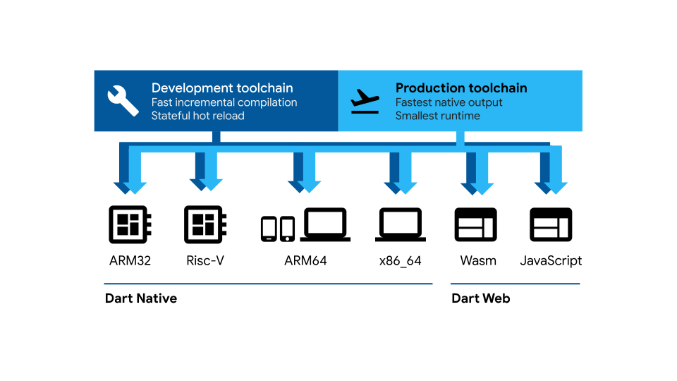

# Dart

## A client-optimized language for fast apps on any platform

Dart is:

  * **Optimized for UI**:
  Develop with a programming language specialized around the needs of user interface creation
  
  * **Productive**:
  Make changes iteratively: use hot reload to see the result instantly in your running app
  
  * **Fast on all platforms**:
  Compile to ARM & x64 machine code for mobile,  desktop, and backend. Or compile to JavaScript for the web

Dart's flexible compiler technology lets you run Dart code in different ways,
depending on your target platform and goals:

  * **Dart Native**: For programs targeting devices (mobile, desktop, server, and more),
  Dart Native includes both a Dart VM with JIT (just-in-time) compilation and an
  AOT (ahead-of-time) compiler for producing machine code.
  
  * **Dart Web**: For programs targeting the web, Dart Web includes both a development time
  compiler (dartdevc) and a production time compiler (dart2js).  

## License & patents

Dart is free and open source.

See [LICENSE][license] and [PATENT_GRANT][patent_grant].

## Using Dart

Visit [dart.dev][website] to learn more about the
[language][lang], [tools][tools],
[getting started][codelab], and more.

Browse [pub.dev][pubsite] for more packages and libraries contributed
by the community and the Dart team.

## Building Dart

If you want to build Dart yourself, here is a guide to
[getting the source, preparing your machine to build the SDK, and
building](https://github.com/dart-lang/sdk/wiki/Building).

There are more documents on our [wiki](https://github.com/dart-lang/sdk/wiki).

## Contributing to Dart

The easiest way to contribute to Dart is to [file issues][dartbug].

You can also contribute patches, as described in [Contributing][contrib].

[website]: https://dart.dev
[license]: https://github.com/dart-lang/sdk/blob/master/LICENSE
[repo]: https://github.com/dart-lang/sdk
[lang]: https://dart.dev/guides/language/language-tour
[tools]: https://dart.dev/tools
[codelab]: https://dart.dev/codelabs
[dartbug]: http://dartbug.com
[contrib]: https://github.com/dart-lang/sdk/blob/master/CONTRIBUTING.md
[pubsite]: https://pub.dev
[patent_grant]: https://github.com/dart-lang/sdk/blob/master/PATENT_GRANT
