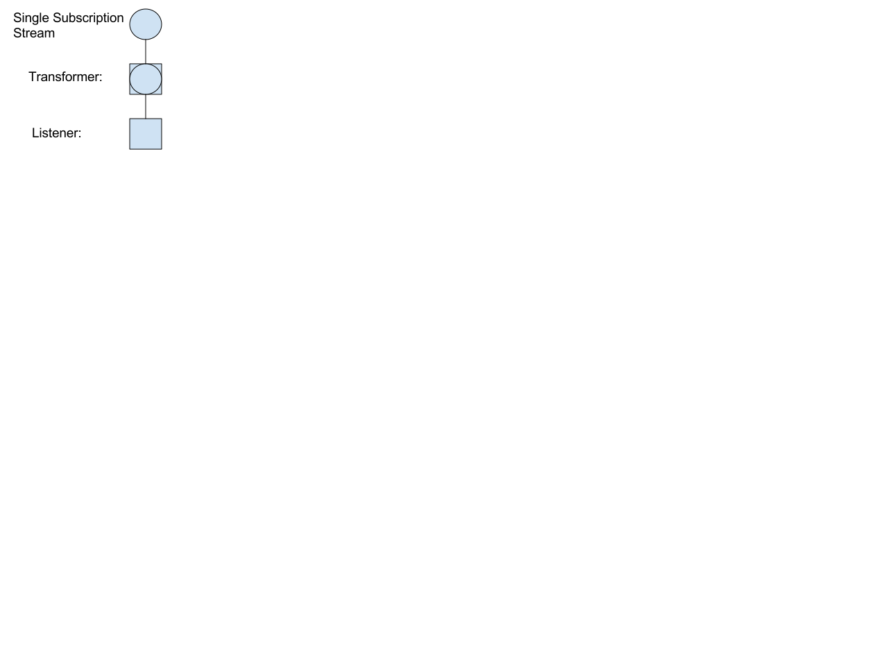
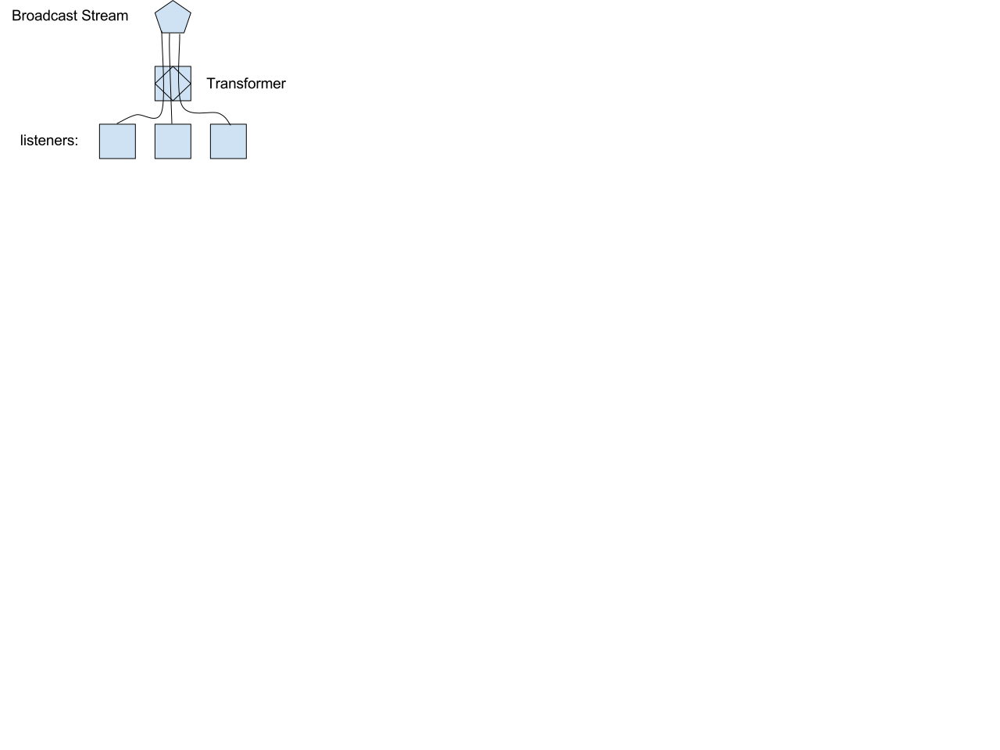
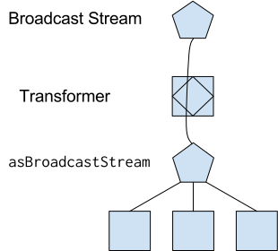
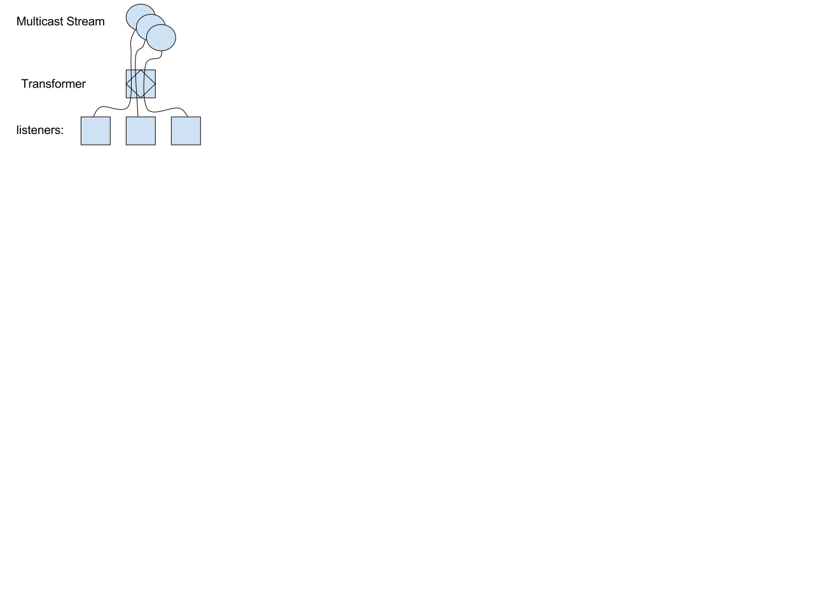

# Dart 2.0 - Core Library Changes
2017-10-27
@floitschG

This document provides an overview of the planned library changes for Dart 2.0.
The proposed changes are not yet final. There are still changes that will happen.

Please provide feedback.

This document covers planned changes to the following libraries: `async`, `collection`, `convert`, `core`, `isolate`, `math`, and `typed_data`. The `mirrors` library needs some updates, but we haven't yet found the time to improve it.

The `io` library, as well as all browser related libraries (`html`, `indexed_db`, `js`, `svg`, `web_audio`, `web_gl` and `web_sql`) are, for organizational reasons, maintained by different teams. We work with them to maintain consistency, but these libraries are not covered in this document.

All changes have been collected in the following CL: https://dart-review.googlesource.com/15127.

The patch contains all proposed changes, but is not complete, nor error-free (and might be out-of-date in some minor details). It is intended to be a tool to help read this document by showing old and new signatures next to each other.

## Updates
* 2017-10-30: added `bufferSize` argument to `Stream.replay`.

## Preface
Library design is opinion based, and it's impossible to get 100% agreement on what a perfect library should look like. For example, `Iterable.isNotEmpty` is a thorn in some developer's eyes; yet considered to be a great addition for others.

Similarly, we got mixed feedback on many occasions. For the same interface, we received requests (usually, but not always, from different developers) to add more methods, and to stop "bloating" the APIs.

In the end, we take every feedback we can get and evaluate it. In some cases, we do adapt the libraries, but very often, sadly, we reject change requests. This shouldn't taken as a sign that we don't listen to feedback. Not every feature can make it into the libraries; not every change fits the Dart library's style.

## Motivation
Our main goal is to provide libraries that are easy to use correctly. After that, we strive for consistency, completeness and convenience while staying minimal. All of these properties are subjective and depend heavily on (amongst other things) the use cases, the size of projects, the education of the developers, and taste. 

We believe that the Dart 1.x libraries were well received, and want to keep the style of the libraries similar to what developers are used to. Despite a relatively large number of accepted issues, we believe that the proposed changes will not fundamentally change the core libraries, and just make them "better".

### Holistic Approach
This document is big. While we could have split it for easier reading, it is not how we, the library team, work on the libraries. It is our opinion that library design should be done holistically (ideally together with the language design). One of the major qualities of a good library is a consistent feel. This is, why changes usually happen in bigger chunks: if one element is changed, some other might also need changes.

There are lots of cross-dependencies that make a holistic approach more successful: if we add a method to `Iterable`, we also have to consider it for `Stream`. If we decide that helper classes should go into packages, then we should do that for all libraries and not just some. (Otherwise we end up with a mixed impression: "why is this here, but not the other?").

Just to give a few more examples:
* Moving `min` and `max` to` int`, `double` and `num` has repercussions on the `BigInt` class. With that move `BigInt.min` is the natural place for `BigInt`'s `min`. If they didn't move, then we would need to rethink how to write our `BigInt` class, and where to put `BigInt`'s `min`. It could be that a member function (like `.clampMin`) would then be a better approach.
* The `Uri` class should use the same modifying method name, `with`, as `DateTime`. This means that we want to look at the two classes at the same time.

These might sound like minor issues, but as library designers we care deeply about how a library feels as a whole.

### Correct Use
For each item of functionality, we try to understand how our users will use it. Frequently, this involves showing code samples to coworkers, and friends, and ask them what they expect the code would do.

If necessary, we adapt the functionality, remove it entirely, or find better names. In this sense  correct interpretation and correct usage are given a higher priority than consistency, completeness or convenience.

### Consistency
Just after "correct use" we put consistency. By providing a consistent API, developers have to learn fewer concepts, and are more productive because they need to search for documentation less often. Consistency is always a requirement to give a language its own style. We often use the term "darty" to refer to APIs that feel similar to Dart's core libraries. This can only be achieved through a consistent use within the core libraries themselves.

Consistency comes in multiple flavors:
- Naming: Methods that do similar things, should have similar names. When possible, conventions make it easier to guess the name and behavior of members. For example, asX always wraps, and toX creates a copy.
- Signatures: Methods with similar arguments should have similar signatures, and parameters that could be given in different ways should agree. For example, Dart always expects ranges as "from", "to" (exclusive). No core Dart function will take "from" and "length".

### Completeness
Completeness comes in two parts:
1. Completeness for consistency sake: if we have `firstWhere`, then we should have `lastWhere` as well.
2. Completeness in terms of functionality. Our libraries should provide the functionality to do common tasks without requiring additional packages. Some of our libraries didn't have functionality that is commonly useful. For example, `DateTime` was missing functionality to work with dates.

### Performance
In general we won't mention performance a lot. That's not because we don't care for it, though. Every feature we add to the libraries is supposed to be efficient. In fact, it is important to note that some features are not in the library plan, specifically, because they can't be implemented efficiently, or would make the compilation of Dart harder.

Also, unless we completely redesign the libraries, there are only very few things that can affect the performance. Almost all the improvements are by refactoring the internals of the libraries, or by improving optimizations. In fact, the biggest changes we dared doing (rewriting the `StreamController`), was with the idea of making it simpler and thus more efficient. We don't expect to see big performance gains, but performance was on our mind. Similarly, the refactorings to `Uri` were driven by known inefficiencies when compiling to JavaScript.

We were always receptive to non-API changes that could improve the performance of the libraries. For example, we moved some concurrent-modification checks into `assert`s, because they showed up on production profiles. In practice these checks are most helpful during development and can be removed during production.

### New Language Features
Some of the proposed changes would look different if the Dart language had different features. For example, extension methods would incite us to move some methods out of classes. The print function should use "rest"-arguments instead of 8 optional positional arguments.

We agree with this sentiment, but we don't want to make our users wait for language features. This is a typical case of perfect being the enemy of good.
Obviously, we don't completely ignore upcoming features, either. When we know which features will come (like rest arguments), we prepare the libraries for them. Switching the print method from 8 arguments to rest-arguments is a non-breaking change.

### In this Document
Throughout this document, we will regularly refer to the above-mentioned properties ("correct use", "consistency" and "completeness"). When appropriate we will, however, group related changes into their own sections. It is easier to think of one big change to, for example, `DateTime` than to see its changes in different categories.

We will also often justify changes as "cleanups". These are often a combination of multiple reasons: correct use, consistency, minimal design, or simply "because it should be this way". Cleanups are often done in classes that already required other changes (and where additional breakages are absorbed by the initial change), or because they are very simple to fix.

#### Breaking Changes
Most of the changes in this document are breaking in some way or another. Even adding a method to an existing class breaks every user that implements the same interface. For some classes implementing the same interface is impossible (`int`, `String`, ...), or very unlikely (for example, `DateTime`), but some classes are subtyped often and changing them can break a significant number of users (for instance `Iterable`). This kind of breakage is, however, simple to fix: in many cases using provided mixins or baseclasses (such as `ListMixin` and `ListBase`) completely avoid breakages, and in others (like `TypeSafeList` from `package:collection`) it's as easy as adding new forwarding methods.

Throughout this document we will provide comments in quotation sections, providing opinions on how breaking these changes are. For example:

> This change is unlikely to break any user. However, even if the class is subtyped, implementing the missing method is trivial.

We won't provide comments for missing methods. As discussed above, developers that implement interfaces from the core libraries simply need to add the missing members. When the classes are commonly subclassed we will provide enough information to make this a painless process.

We won't provide comments when we move classes into packages or other libraries. For all of them, the following opinion applies:

> Moving the class to a package or other library is breaking, but can be detected statically. The fix is to simply add the corresponding package to the pubspec (if it isn't there yet) and to import that library that contains the class.

#### Constants
The convention to name constants with lowercase identifiers was only introduced after the Dart 1.x libraries were finished. With Dart 2.0 we now refactor all of our constants to follow the Dart style guide. Some of these renamings are mentioned in the remainder of this document, but most aren't.

> Renaming constants to lower-case may introduce two cases of breakages:
>  1. Users of the constants have to update their code.
>  2. Unqualified accesses to super members could now resolve to a global constant.
>
> We can ease the migration to lower-case constants by providing both at the same time for some time. The migration itself is extremely straight-forward and can be automated in many cases.
>
> The second reason for breakages is extremely rare. It's also likely that the type system would catch many of them. We don't think we have to worry about that case.

## dart:core
#### Annotations
We renamed the `expires` field of the `Deprecated` class to `message`.

We removed the `Proxy` (and `proxy`) annotation, since it is not useful in Dart 2.0 anymore.

> Renaming instance members is, in theory, slightly more breaking than static elements. If a user accessed the expires field of Deprecated through dynamic, a static analysis tool would not be able to detect the breakage. This, on its own, is already very unlikely. Furthermore, this class and field is not used very frequently.

#### Random
The `Random` class was moved from `dart:math` to `dart:core`. The `int`, `double` and `bool` classes now have a static `random()` method that returns a random value of the corresponding type. The int type has two versions of the random method: `int random(int max)` and `int randomRange(int from, int to)`. (We are not yet fully sold on `randomRange`. It sounds like it would return a random range and not a value in that range).

Moving Random to dart:core has two advantages:
1. Random is commonly used, and
2. it makes the dart:math library really math centric. As described in the dart:math section, the `math` library has been cleaned and now serves the intended purpose of providing mathematical functionality.

#### Numbers
The `clamp` method on numbers is used to bring a specific value into a certain range. Unfortunately, there is no good way to type it on `num` while still returning the receiver type on the two subtypes `int` and `double`. That is, we would like `double.clamp` to take two doubles and return again a double. For this reason, we decided to move clamp to the respective subtypes and remove it from `num`.

Similar reasons (in addition to those mentioned in earlier) were considered when we decided to move `min` and `max` from `dart:math` as static methods to `num`, `int` and `double`. This makes the functions type-safer and makes the generic argument unnecessary. It also makes the `int` and `double` versions faster.

The `int.toRadixString` function now takes a `digits` and `prefix` named argument:
``` dart
  /**
   * ...
   * If [digits] is present, returns at least [digits] digits, filling the
   * missing digits with `0`.
   *
   * If [prefix] is provided, prefixes the result with the given [prefix].
   *
   * Example:
   * ```
   * print(26.toRadixString(16, digits: 4, prefix: "0x"));  // => "0x001A"
   * ```
   */
  String toRadixString(int radix, {int digits, String prefix = ""});
```
(`digits` doesn't indicate that this is the *minimal* number of digits, so we might revisit this argument name).

Outside the browser integers are now fixed-size (64 bits) in Dart 2.0. The `int` class thus gains a `>>>` (unsigned shift) operator. Similar to most other C-like languages, the `>>` operator is now the signed shift, smearing the sign-bit, and `>>>` is the unsigned shift, filling in `0`s at the left.

This change is pending language changes, since this operator doesn't exist in Dart yet. Since `int` is not user-implementable, this change is non-breaking and could be shipped at a later Dart 2.x time.

Also see the dart:typed_data section for the introduction of a `BigInt` class.

> Moving the `clamp` method to `int` and `double` is potentially breaking. Users who need to do the clamping on `num` need to reimplement the function themselves. The benefit of having a type-safe variant on `int` and `double` should outweigh the breakage-cost.
>
> All other number API changes are non-breaking.

#### Print
We are modifying `print` to take multiple arguments. For now we just take up to 8 optional arguments. Eventually, the function will use rest arguments to take an arbitrary number of objects.

This change is motivated by the desire to `print` objects on consoles and still be able to inspect them, similar to what happens when using `console.log` in JavaScript.

As a consequence we have to change the `Zone` API as well: the `print` hook in `Zone`s now takes a `List<Object>` instead of a simple `String`.

Also note that we now accept `print` with no arguments as well.

> The `print` change itself is non-breaking.
>
> The API change to `Zone` is breaking, but only affects developers that hook into the `print` callback of `Zone`s. The fix for these hooks is easy.

#### Uri
The `Uri` class will change behavior. The current class is subtly incompatible with the URL functionality built into browsers, which makes it impractical to use the native methods even when they are available. That's unnecessarily inefficient.

We will change the class to behave very closely like the WHATWG URL specification, but will still maintain mostly the same API, with few major changes. Contrary to the WHATWG_URL specification, we will still be able to represent relative URI references, which the DOM URL doesn't allow, and to handle `package:` URIs in a predictable way.

One major change is that interpretation of the URI query is delegated to a new class, a `UriQuery`, instead of having multiple methods on the `Uri` class itself (and requests for more).
An interpreted query will no longer be treated as just a map from string to string, which was always inadequate (one query key can have multiple values). This affects all places in the API where a query is represented as a `Map`, including constructor arguments. Instead of:
``` dart
var uri = Uri.http("example.org", "/path", {"q": "dart"});  // Using optional `new`.
```
you will have to write:
```
var uri = Uri.http("example.org", "/path", UriQuery({"q": "dart"}));  // Using optional `new`.
```

The expected API of UriQuery (annotated with the DOM URL API it uses) is:
``` dart
/// Representation the query part of a URI.
///
/// A query is a set of key/value pairs, the "entries" of the query.
/// The [UriQuery] gives access to individual entries or to the key/value mapping.
///
/// The [parse] method parses URL-form-encoded query parameters, and the [toString]
/// method creates a URL-form-encoded representation of the query. 
/// All other methods operate on unencoded strings.
abstract class UriQuery {
  /// Creates a new query with a single value for each key.
  factory UriQuery([Map<String, String> entries]) => 
      (new UriQueryBuilder()..addEntries(entries.entries)).toQuery()

  /// Creates a new query which can have multiple values for each key.
  factory UriQuery.multi(Map<String, Iterable<String>> entries) {
    var builder = new UriQueryBuilder();
    entries.forEach(builder.addAll);
    return builder.toQuery();
  }

  /// Creates a new query with the provided entries.
  factory UriQuery.fromEntries(Iterable<MapEntry<String, String>> entries) => 
    (new UriQueryBuilder()..addEntries(entries)).toQuery();

  /// Parses a URI query string in `application/x-www-form-urlencoded` format.
  ///
  /// The [queryString] may be preceded by a leading `?` character, in which case
  /// that character is not considered part of the query.
  ///
  /// Throws a [FormatException] if parsing fails.
  external static UriQuery parse(String queryString);

  /// Tries to parse [queryString] as a [UriQuery].
  ///
  /// Same as [parse] but returns `null` when the parsing fails.
  external static UriQuery tryParse(String queryString);

  /// The encoded text of the query, as it would be included in a URL.
  /// 
  /// Contains all entries separated by `&` characters, and each key and
  /// value separated by a `=` character. The individual keys and values are
  /// are URL-form-encoded. There is no leading question mark.
  /// If the query has no entries, the returned strings is empty.
  String toString();  // URL.stringifier

  /// Whether the query contains an entry with [key] as key.
  ///
  /// The provided [key] should not be encoded. The keys of the query object
  /// are decoded before being compared to [key].
  bool contains(String key);  // URL.has

  /// Look up the value, if any, of a key,
  ///
  /// Returns `null` if the key is not present or has no value.
  /// Otherwise returns the first value associated with key.
  String operator[](String key);  // URL.get

  /// The keys of entries in the query.
  ///
  /// Each key is only reported once, even if it occurs multiple times
  /// with different values.
  Iterable<String> get keys; // iterate entries, return key.

  /// All values associated with [key].
  ///
  /// If [key] occurs more than once once, this allows access to all the values.
  Iterable<String> values(String key);  // URL.getAll

  /// Take an action for each entry in the query.
  ///
  /// If a key occurs multiple times, the [action] is taken for each instance,
  /// irrespectively of the value (or absence of value).
  /// The key and value are decoded before being passed to [action].
  void forEach(void action(String key, String value));  // iterate entries

  /// Each key/value combination as a [MapEntry].
  ///
  /// The [Object.toString] of the entry is the original query text for
  /// the entry.
  Iterable<MapEntry<String, String>> get entries;  // iterate entries

  /// Exposes the keys and first-values of each key as a map.
  Map<String, String> asMap();  // Wrapper using has/[]

  /// Exposes the keys and all values of each key as a map.
  Map<String, Iterable<String>> asMultiMap();  // Wrapper using has/getAll
}

/// Builder for [UriQuery] objects.
///
/// Builds a sequence of key or key/value entries.
/// The sequence is retained in insertion order.
abstract class UriQueryBuilder {
  UriQueryBuilder([UriQuery initialContent]) = _UriQueryBuilder;

  // Returns a [UriQuery] with the current entries of this builder.
  //
  // Clears this builder as if calling [clear].
  UriQuery toQuery();

  /// Whether the query contains any entries for [key].
  bool contains(String key);  // URL.has

  /// All the values associated with [key].
  ///
  /// If an entry for key has no value, the `null` value is used instead.
  List<String> values(String key);  // URL.getAll+toList

  /// All the entries of the query.
  ///
  /// Entries with not value are represented by a [MapEntry] with a null value.
  List<MapEntry<String, String>> get entries;  // Iterate entries

  /// Sets [value] as the only value for [key].
  ///
  /// Removes all existing entries for [key] and adds [key]/[value] as
  /// the only entry.
  ///
  /// If [value] is `null`, the added entry has no value.
  void operator []=(String key, String value);  // URL.set

  /// Sets [values] as the only values for [key].
  ///
  /// Removes all existing entries for [key] and adds [key]/value as
  /// an entry for each value in [values].
  ///
  /// If any of [values] are `null`, the corresponding entry has no value.
  void setAll(String key, Iterable<String> values); // Url.remove+Url.append

  /// Adds an entry for [key] with [value] as value.
  ///
  /// Retains all previous entries for [key] and adds one more.
  ///
  /// If [value] is omitted or `null`, an entry with no value is added.
  ///
  /// The entry is added after all existing entries.
  void add(String key, [String value]);  // URL.append

  /// Adds multiple entries for [key].
  ///
  /// If any of [values] are `null`, the corresponding entry has no value.
  /// This retains all previous entries for [key] and adds more.
  ///
  /// The entries are added after all existing entries, in iteration order.
  void addAll(String key, Iterable<String> values);  // URL.append

  /// Adds multiple entries.
  ///
  /// For each entry in [entries], add that key/value entry to the query.
  /// If a value is `null`, the corresponding query entry has no value.
  ///
  /// The entries are added after all existing entries, in iteration order.
  void addEntries(Iterable<MapEntry<String, String>> entries);  // URL.append

  /// Sorts the current entries by key.
  ///
  /// Retains the current order of values for each key.
  ///
  /// If [compareKey] is omitted, keys are sorted lexically by
  /// [String.compareTo].
  // Use URL.sort if available and compareKey == null, otherwise manual
  // by sorting entries and reinserting.
  void sortKeys([int compareKey(String key1, String key2)]);

  /// Sorts all the entries.
  ///
  /// If [compare] is omitted, entries are first sorted by key, and then the
  /// values for each key are sorted, all ordered by [String.compareTo]
  // Sort manually, no URL support.
  void sort([
      int compare(MapEntry<String, String> e1, MapEntry<String,String> e2)]);

  /// Removes all entries.
  void clear();  // replace internal object

  /// Removes all entries for the provided [key].
  ///
  /// Has no effect if the key does not occur in the query.
  void remove(String key);  // URL.delete

  /// Removes a single entry.
  ///
  /// If the same entry occurs more than once in the query, only the
  /// first such entry is removed.
  ///
  /// Has no effect if this particular key/value pair does not occur in the
  /// query.
  void removeEntry(String key, String value);  // Completely manual.

  /// Returns a string representation of the query.
  ///
  /// The representation can be used as the query-part of a URI.
  /// It includes a leading `?` if there is at least one entry in the query.
  /// This is the same string returned by toQuery().toString().
  String toString();  // URL.stringifier
}
```

Other than the `UriQuery` change, all but one of the remaining changes to the `Uri` class do not affect the API.
* Only a list of recognized schemes are considered as having an authority part (the WHATWG URL "special" URLs). We add `package:` as a special scheme that the Dart Uri class recognizes.
* The `resolve` and `resolveUri` methods will only work on URIs with a scheme, not on URI references without a scheme. This is how the WHATWG URL works too, and it differs from the current implementation which does a best-effort attempt at merging. It might be possible to remove this restriction, but at the cost of implementing it ourselves even in a browser. 
* The `isAbsolute` getter was never useful as written. It reflects a property of the URI specification that isn't actually useful to users. It is changed to do what most users expect: Say whether the `Uri` instance is a full URI with a scheme, not a relative URI reference.
* The replace method is renamed to `with` (which we will change to not be a reserved word in Dart 2). You can write:
  ``` dart
  var uri = Uri.parse("http://example.org/path?w=dart");
  var secureUri = uri.with(scheme: "https");
  ```
* The static helper methods for doing to do various kinds of escaping will be aligned to exactly match the escapes available in a browser: The ECMAScript `escapeURI` and `escapeURIComponent` methods and the escaping done by `URLSearchParams` objects.
* The `toFilePath` method is removed. It requires the URI implementation to know whether it's on a Windows based platform, which is not something the system should know or care about outside of the `dart:io` library. We will make sure that this functionality is still available in the `dart:io` library.
* The `==` and `hashCode` is defined in terms of the non-normalized URI representation. You may want to normalize

> The most common use of `Uri` is its parser: `Uri.parse`. For the most part (except our tests), the provided string can be easily parsed and doesn't encounter corner cases. For the majority of users, this change is thus non-breaking.
> The `UriQuery` change is also breaking. The class provides an indexing operator with makes its use very similar to the `Map` that was there before, but there will be cases where the upgrade requires some effort.

#### Completeness
The `bool` class now features the non-shortcutting versions of `&&` and `||`: `&` and `|`. It also has the exclusive-or (`^`) operator (equivalent to `b1 != b2` for non-null boolean values). Having them as operators makes it possible to use them in compound assignments: `someBool &= alwaysComputeSomeBool` without shortcutting the right-hand side.

The `Future` and `Stream` class from `dart:async` are now also exposed from `dart:core`. This means that the return types of `async` and `async*` functions can now be expressed without importing `dart:async` first.

The `Duration` class now has a static `Duration.parse` method, which will (at least) parse the output of its own `toString`, ISO-8601 durations, and the output of Go durations. Similarly to all other `parse` methods there will be a `tryParse` next to the method. See below for more details on `tryParse`.

The `Invocation` class can now be instantiated. We added the following constructors:
``` dart
  const Invocation.method(Symbol memberName, {List<Object> positionalArguments,
      Map<Symbol, dynamic> namedArguments, List<Type> typeArguments});

  const Invocation.getter(Symbol memberName);

  /// The provided [setterName] should have a trailing '='.
  const Invocation.setter(Symbol setterName, Object value);
```
We also added a `typeArguments` getter for generic types.

While cleaning up the `Invocation` class we also decided to improve its `toString` message. This improvement will probably only hit the VM/Flutter, since dart2js and DDC don't have as much information available as the VM does.

The `Function.apply` function now takes optional generic types, and the optional parameters are named instead of positional:
``` dart
external static apply(Function function, List positionalArguments,
      {Map<Symbol, dynamic> namedArguments, List<Type> typeArguments});
```

We have added a `Symbol.empty` constant and will add all operators as static constants on `Symbol`. (We haven't decided on the names yet, and would appreciate feedback). Also, we now give direct access to the name of a symbol through the `name` getter. When minified the name getter will return the *minified* name. This is in response to users doing `String.substring` on the `toString` of `Symbol` instances, which was already returning the minified symbol.

The `StringSink` class (and as a consequence the `StringBuffer class`) now also contains `addCharCodes`. It already had `addCharCode`.

In the `RegExp` class the `firstMatch`, `hasMatch` and `stringMatch` functions now take optional `start` arguments. This avoids costly `substring` operations.

> Except for the additional methods in `StringSink` and the change of the optional parameter type of `Function.apply`, none of the changes in this section are breaking to non-subtypes.

#### Consistency
All `parse` functions received a corresponding `tryParse` function that returns `null` when the input is invalid. The `onError` arguments (positional or named) will be removed. This change affected:
* `double.parse`: was an optional positional argument.
* `DateTime.parse`.
* `Duration.parse`: didn't exist before (see above).
* `Uri.parse`.

The `tryParse` function returns `null` when the input is invalid, which can be nicely combined with the `??` operator: `int.tryParse(someString) ?? 0`.

> Removing the optional `onError` functions is breaking, but they are easy to find (since these are static calls), and generally easy to fix by changing them to `tryParse` calls.

#### Convenience
The `UnsupportedError` makes the message argument optional. In most cases the stack trace already identifies the unsupported functionality, and providing a message argument feels redundant.

We finally provide means to combine hashcodes. As a starting point we added `Object.hash` as a static function. It currently takes up to ten arguments (of which the last 9 are optional). Once we have rest-arguments we will change the function to take an arbitrary number of arguments. At that point it will also be possible to spread lists of objects.

Strings will support UTF-8, UTF-16 and UTF-32 conversions directly. For simple conversions, one doesn't need to use `dart:convert` anymore. The following constructors and methods are now part of `String`.

``` dart
  factory String.fromUtf8(List<int> codeUnits, [int start = 0, int end]);
  factory String.fromUtf16(List<int> codeUnits, [int start = 0, int end]);
  factory String.fromUtf32(List<int> codeUnits, [int start = 0, int end]);

  Uint8List toUtf8([int start = 0, int end]);
  Uint16List toUtf16([int start = 0, int end]);
  Uint32List toUtf32([int start = 0, int end]);
```

> All of these changes are non-breaking.

#### Cleanups
Removed `AbstractClassInstantiationError` which can't happen in Dart 2.0 anymore.

The `TypeError` is not an `AssertionError` anymore.

Removed the `IntegerDivisionByZeroException`. It never really was an `Exception`. If an integer division receives `0` it should just throw an `ArgumentError`.

The `NoSuchMethodError` class now takes an `Invocation` as argument. This makes it easier to construct from within `noSuchMethod` functions, and makes it possible to reuse the newly introduced Invocation constructors (see above).

We removed the `group()` method in Match. It was an alias for the indexing operator. This means that `match?.group(5)` is not possible anymore, but we prefer fixing this by providing a null-aware index access in a future language change.

We also changed the `groups` function so that the `groupIndices` are optional. This means that `match.groups()` now returns a list with all matches (including the full match as 0th entry).

We moved the `BidirectionalIterator` from `dart:core` to `dart:collection`.

> In theory, users could use the fact that TypeError implemented AssertionError. This is highly unlikely, though.
>
> Removing the `IntegerDivisionByZeroException` breaks programs that relied on it. However, in the browser this exception was never thrown (since dart2js couldn't know if the argument was a `0` or `0.0`). Also, as indicated by the replacement with `ArgumentError`, we consider a division by `0` as an error which should not happen in programs.
>
> Changing the constructor of `NoSuchMethodError` is breaking. It can be statically detected, though (since constructors can not be torn off), and the fix is very simple. Few developers instantiate their own `NoSuchMethodError`s, so the change won't affect many users.
>
> The removal of group in Match potentially affects more users, but the work-around is very simple.

#### Types
The `Object.runtimeType` is being removed and replaced by `Type.of(object)`. The idea of being able to emulate other classes by changing the `runtimeType` sounds interesting, but since Dart doesn't support any means to also manipulate the `is` operator, its uses are extremely limiting. The static `Type.of` function is less error-prone and more efficient for compilers.

In addition, we intend to make `Type` more useful by making it a generic class, and by adding methods to compare types among each other:
``` dart
abstract class Type<T> {
  static Type<S> of<S>(S Object) {}

  /**
   * Returns whether [other] is a subtype of this.
   */
  bool isSubtypeOf(Type other);
  bool isSupertypeOf(Type other);

  /**
   * Returns whether this class is the type of [o].
   */
  bool accepts(Object o);
}
```

The generic argument to `Type` is still pending language changes. Currently, a generic function type (like the type of the tear-off of `List.map`) is not allowed to be used as a generic argument. This would make `Type.of(list.map)` not work, or infer `Type<Function>` for that expression.

> For most cases, the .runtimeType should just be replaced by the static call to Type.of.
>
> The change can be more breaking, if users overwrote the runtimeType getter. In that case it's necessary to refactor the code on a case-by-case basis.
>
> When compiling with dart2js the necessary information to make isSubtypeOf and isSupertypeOf work might increase the code size. This can be mitigated in 3 ways:
> By not using the methods when compiling to the web. (A short-term solution).
> By providing a flag to disable relationships of DOM classes (which would be the reason for the biggest chunk of the size increase).
> By optimizing the inheritance-relationship in dart2js. The implementation of Types in dart2js is sub-optimal, and should be reworked (also for the strong type system).

#### DateTime
We made `DateTime` significantly better for use as dates. Here is the new API. (All methods without dartdocs have not changed).

``` dart
class DateTime implements Comparable<DateTime> {
  // All constants are lowercase now.
  static const int monday = 1;
  static const int tuesday = 2;
  static const int wednesday = 3;
  static const int thursday = 4;
  static const int friday = 5;
  static const int saturday = 6;
  static const int sunday = 7;
  static const int daysPerWeek = 7;

  static const int january = 1;
  static const int february = 2;
  static const int march = 3;
  static const int april = 4;
  static const int may = 5;
  static const int june = 6;
  static const int july = 7;
  static const int august = 8;
  static const int september = 9;
  static const int october = 10;
  static const int november = 11;
  static const int december = 12;
  static const int monthsPerYear = 12;


  final bool isUtc;

  DateTime(int year,  [int month = 1, int day = 1, int hour = 0, int minute = 0, int second = 0, int millisecond = 0, int microsecond = 0]);

  /**
   * Constructs a [DateTime] instance with the current date.
   *
   * The resulting [DateTime] is in UTC and has the time set to 00:00.
   */
  factory DateTime.today();

  /**
   * Constructs a [DateTime] for the given date.
   *
   * The resulting [DateTime] is in the UTC and has the time set to 00:00.
   */
  DateTime.date(int year, int month, int day);

  DateTime.utc(int year,  [int month = 1, int day = 1, int hour = 0, int minute = 0, int second = 0, int millisecond = 0, int microsecond = 0]);

  DateTime.now() : this._now();

  // Improved to accept RFC1123 format (and more of RFC 3399).
  // Now errors, if the entries are out of range (like a month alue of 13).
  // Now has an `onError` optional named argument.
  static DateTime parse(String formattedString);

  /**
   * Constructs a new [DateTime] instance based on [formattedString].
   *
   * Same as [parse] but returns `null` if the [formattedString] is invalid.
   */
  static DateTime tryParse(String formattedString);

  DateTime.fromMillisecondsSinceEpoch(int millisecondsSinceEpoch, {bool isUtc: false});
  DateTime.fromMicrosecondsSinceEpoch(int microsecondsSinceEpoch, {bool isUtc: false});

  bool operator ==(other);
  bool isBefore(DateTime other);
  bool isAfter(DateTime other);
  bool isAtSameMomentAs(DateTime other);
  int compareTo(DateTime other);

  DateTime toLocal();
  DateTime toUtc();

  /**
   * Returns this instance suitable for date computations.
   *
   * The resulting DateTime is in the UTC timezone and has the time set to 00:00.
   */
  DateTime toDate() => new DateTime.date(year, month, day);

  /**
   * Returns a [DateTime] instance with the provided arguments replaced by the
   * new values.
   *
   * The returned DateTime is constructed as if the [DateTime] constructor was
   * called. This means that over and underflows are allowed.
   */
  DateTime with({int year, int month, int day, int hour, int minute, int second,
      int millisecond, int microsecond, bool isUtc});

  String toIso8601String() {

  /**
   * Returns a string following the RFC 1123 specification.
   *
   * This format is used in cookies.
   * 
   * It is called `toUTCString` in EcmaScript. 
   */
  String toRfc1123String() {
    // https://stackoverflow.com/questions/25658897/is-utc-a-valid-timezone-name-for-rfc-1123-specification
    // TODO(floitsch): Tue, 05 Sep 2017 13:43:53 GMT.
    return "TODO";
  }

  /**
   * Returns a new [DateTime] instance with the provided arguments added to
   * to [this].
   *
   * ```
   * var today = new DateTime.now();
   * var fiftyDaysFromNow = today.add(new Duration(days: 50));
   * ```
   *
   * Be careful when working with dates in local time and durations. A
   * `new Duration(days: 3)` is actually `3 * 24 * 60 * 60` seconds. Use
   * the [days] named argument if you want to ensure that the resulting time is
   * still the same.
   *
   * Adding a specific number of months will clamp the day, if the resulting
   * day would not be in the same month anymore:
   *
   * ```
   * new DateTime(2017, 03, 31).add(months: 1); // => 2017-04-30.
   * ```
   *
   * Days are added in such a way that the resulting time is the same (if that's
   * possible). When daylight saving changes occur, adding a single [day] might
   * add as little as 23, and as much as 25 hours.
   *
   * The arguments are added in the following way:
   * * Compute a new clock-time using [microseconds], [milliseconds], [seconds],
   *   [minutes], [hours]. At this time, days are assumed to be 24 hours long
   *   (without any daylight saving changes). If any unit overflows or
   *   underflows, the next higher unit is updated correspondingly.
   * * Any over- or underflow days are added to the [days] value.
   * * A new calendar date is computed by adding 12 * [years] + [months] months 
   *   to the current calendar date. If necessary, the date is then clamped.
   * * Once the date is valid, the updated [days] value is added to the
   *   calendar date.
   * * The new date and time values are used to compute a new [DateTime] as if
   *   the [DateTime] constructor was called. Non-existing or ambiguous times
   *   (because of daylight saving changes) are resolved at this point.
   * * Finally, the [duration] is added to the result of this computation.
   *
   * All arguments may be negative.
   * ```
   * var tomorrowTwoHoursEarlier = date.add(days: 1, hours: -2);
   * var lastDayOfMonth = date.with(day: 1).add(month: 1, days: -1);
   * ```
   */
  // All values default to 0 (or a duration of 0).
  DateTime add({int years, int months, int days, int hours,
    int minutes, int seconds, int milliseconds, int microseconds,
    Duration duration});

  /**
   * Returns a new [DateTime] instance with the provided arguments subtracted
   * from [this].
   *
   * This is equivalent to calling [add] with all given arguments negated.
   */
  external DateTime subtract({int years, int months, int days, int hours,
    int minutes, int seconds, int milliseconds, int microseconds,
    Duration duration});

  Duration difference(DateTime other);

  int get millisecondsSinceEpoch;
  int get microsecondsSinceEpoch;
  String get timeZoneName;
  Duration get timeZoneOffset;

  int get year;
  int get month;
  int get day;
  int get hour;
  int get minute;
  int get second;
  int get millisecond;
  int get microsecond;
  int get weekday;

  /**
   * Returns which day of the year this DateTime represents.
   *
   * The 1st of January returns 1.
   */
  int get dayInYear;
}
```

The reason for the breaking change of add is that we want to make date-time manipulations easier in face of daylight savings. Currently, a common mistake is to write `dt.add(const Duration(days: 1))` and to expect a new date on the following day with the same time. However, this is not true when there is a daylight savings change.

By giving easy access to `add(days: 1)` we make it easier for users not to run into this trap. It is also easier to read.

The alternative would be to add a different `addX` method (with the same named arguments), or to add separate `addDays`, `addMonths` ... methods. This is the approach that, for example, C# took.

> This change is breaking in two ways:
> subtypes have to add the new methods.
> the add method now takes named arguments instead of the one positional `Duration` argument.
> Users of the `add` method now need to prefix their argument with "duration:". We feel that the benefits of the new API is worth the cost of migration.

#### Collections
Most of the collection changes are additive. They are breaking in that implementers of these class interfaces now need to provide the same functionality (unless they get them for free with our mixins or base classes).

##### Iterable
Since `List` and `Set` (as well as `Queue` from `dart:collection`) are subtypes of Iterable all the following changes apply to these interfaces as well.

We added some methods that make it easier to type programs correctly, now that dynamic can't be used as escape-hatch anymore:

``` dart
  /**
   * Returns a new lazy [Iterable] with all elements that are of type [T].
   *
   * All elements that are not of type [T] are omitted.
   */
  Iterable<T> whereType<T>() => new WhereTypeIterable<T>(this);

  /**
   * Returns the elements of this iterable as an `Iterable<T>`.
   * 
   * Returns a new lazy [Iterable] that wraps this iterable 
   * and enforces the provided generic type [T].
   *
   * Whenever this iterable returns or takes a [T] inserts checks to ensure
   * that the new contract is verified.
   * Subclasses may choose to provide a cast operation that returns an instance
   * of the subtype with the new type argument. 
   * The classes [List], [Set] and [Queue] all do so.
   */
  Iterable<T> cast<T>() => new CastIterable<T>(this);
```

A call to cast wraps the receiver and provides the requested typed interface. Subtypes are encouraged to provide matching types (`List` provides a `List`, `Set` a `Set`, ...).

The wrapper should avoid returning wrapped results when it creates a new object. For example, the `toSet()` method of the `CastIterable` should not be implemented as follows:
``` dart
Set<E> toSet() {
  return _wrapped.toSet().cast<E>();
}
```

This is not just a performance question, but also has semantic impact, since checks are delayed even more, and the user would expect `listOfInt.cast<num>().toList()..add(3.14)` to succeed. This is only true for operations that are already eager. Lazy operations should wrap:
``` dart
Iterable<E> skip(int count) {
  return _wrapped.skip(count).cast<E>();
}
```
This is necessary to support infinite iterables.

For convenience and completeness we have added a few (often RX inspired) methods:
``` dart
  /**
   * Combines the provided [iterables] by taking one of each and grouping them
   * in a list.
   */
  static Iterable<List<T>> zip<T>(Iterable<Iterable<T>> iterables);

  /**
   * Creates a new iterable from this stream that discards some elements.
   *
   * Same as:
   *
   * ```
   *where((event) => !test(event))
   * ```
   */
  Iterable<T> whereNot(bool test(T event)) {
    return new WhereIterable(this, test, invert: true);
  }

  /**
   * Groups the elements of this iterable according to the [key] function.
   */
  Map<K, List<E>> groupBy<K>(K key(E element)) {
    var result = <K, List<E>>{};
    for (var e in this) {
      result.putIfAbsent(key(e), () => <E>[]).add(e);
    }
    return result;
  }

  /**
   * Combines a sequence of values by repeatedly applying [combine] and emits
   * every intermediate result.
   *
   * Similar to [Iterable.fold], except that the intermediate results are
   * emitted on the returned [Iterable].
   *
   * If [emitInitialValue] is `true` also emits the [initialValue] 
   * as first element.
   */
  Iterable<S> foldEmit<S>(S initialValue, S combine(S previous, E element),
      { bool emitInitialValue: false });

  /**
   * Reduces a collection by iteratively combining elements
   * of the collection using the provided function. Each intermediate result
   * is emitted to the result iterable.
   *
   * This function is similar to [reduce] but emits the intermediate results.
   */
  Iterable<E> reduceEmit(E combine(E previous, E element));

  /**
   * Returns the concatenated iterable of this [Iterable] and [other].
   *
   * The returned [Iterable] is lazy, and only starts iterating over
   * [this] and [other] when needed.
   */
  Iterable<E> followedBy(Iterable<E> other);
```

Extensions methods (if available in Dart) could provide this functionality, but 1. Dart doesn't have extension methods, and 2. they would not allow as efficient implementations. For example, the `.followedBy` implementation of a `List` will be different than the one of `Iterable`.

The `whereNot` is clearly redundant with `where`. We have included for similar reasons as `isNotEmpty`: it is a relatively common operation and makes the code much easier to read. Especially with tear-offs the code becomes simpler:

``` dart
it1.where((x) => !mySet.contains(x));  // Old.
it1.whereNot(mySet.contains);  // New.
```

Implementation-wise, the `whereNot` functionality would reuse the same class as `where` and would thus only add minimal code.

Finally, we added the missing `orElse` in `singleWhere`. This makes the function consistent with `firstWhere` and `lastWhere`: `E singleWhere(bool test(E element), {E orElse()})`.

> Due to the existing `IterableMixin` and `IterableBase` we expect this change to be less painful than it looks. Almost all classes that don't use these two classes only forward or wrap an existing `Iterable`. As such the migration should be easy.

#### List and Set
Lists and sets only needed few changes (in addition to `Iterable` changes). Both had similar cleanups for their constructors: `List.from` and `Set.from` now take typed Iterables:
``` dart
factory List.from(Iterable<E> elements, {bool growable: true});
Set.from(Iterable<E> elements) = LinkedHashSet<E>.from;
```

`List.from` is frequently used to change the generic type of an existing `List` instance. In these cases, one will need `cast` or `castCopy` as a replacement.
> The change is consistent with other strongifications of the libraries, though.

##### List
As promised we added the `+` operator to lists. One can finally write `list1 + list2`.

We added `copy` methods to List:
``` dart
  /**
   * Creates a new list of the same type as this list.
   *
   * The new list contains the same elements as this list.
   * If [start] and [end] are provided, the new list will only contain
   * the elements from [start] to, but not including, [end],
   * and the length of the list match the new number of elements.
   *
   * The provided range, given by [start] and [end], must be valid.
   */
  List<E> copy([int start = 0, int end]);

  /**
   * Creates a new list of the same kind as this list.
   *
   * The new list will have [T] as element type.
   *
   * The new list contains the same elements as this list.
   * If [start] and [end] are provided, the new list will only contain
   * the elements from [start] to, but not including, [end],
   * and the length of the list match the new number of elements.
   *
   * All the elements of the copied range must be assignable to [T].
   *
   * The provided range, given by [start] and [end], must be valid.
   *
   * Some kinds of lists cannot be created with arbitrary types.
   * For example, a [Uint8List] cannot be copied as a list with
   * an element type different from [int].
   * In such a case, the list implementation must document what
   * it does instead.
   */
  List<T> castCopy<T>([int start = 0, int end]);
```

These would mean that there are now 4 ways to create a copy of a `List`:
1. `copy`,
2. `toList`,
3. `new List.from()`,
4. `sublist`.

Clearly, that's not a good idea. We are still investigating the best solution to this problem. We like `copy`, because it works for other classes (like `Map`, `Set` and `Queue`) and has a corresponding `castCopy` (which is necessary to correctly implement `.cast<T>().toList()`).

We are debating whether we should deprecate `sublist` (which can be fully implemented with `copy`), and then make `toList()` just a shorthand for `new List.from()`. This makes sense, since `toList()` takes a named argument `growable` which only applies to the core library's `List` implementation.

For `Set`, where a similar problem arises, this would be a breaking change: so far we have recommended that `toSet()` maintains the same properties as the `Set` it comes from. For example, `identitySet.toSet()` currently is supposed to return again an identity-set.

We added idiomatic ways to set the first and last element of the list without using the index operator:
``` dart
  set first(E newValue);  // { this[0] = newValue; } + throw if empty.
  set last(E newValue);  // { this[length - 1] = newValue; } + throw if empty.
```

`List` already had functions to search for elements that satisfy specific predicates (`firstWhere`, and `lastWhere`), but now we added functions that return the indices of the found element. These are consistent with indexOf found in List.

``` dart
  /**
   * Returns the first index in the list that satisfies the provided [predicate].
   *
   * Searches the list from index [start] to the end of the list.
   * The first time an object `o` is encountered so that `predicate(o)` is true,
   * the index of `o` is returned.
   *
   * ```
   * List<String> notes = ['do', 're', 'mi', 're'];
   * notes.indexWhere((note) => note.startsWith('r'));       // 1
   * notes.indexWhere((note) => note.startsWith('r'), 2);    // 3
   * ```
   *
   * Returns -1 if [element] is not found.
   * ```
   * notes.indexWhere((note) => note.startsWith('k'));    // -1
   * ```
   */
  int indexWhere(bool predicate(E x), [int start = 0]);

  /**
   * Returns the last index in the list that satisfies the provided [predicate].
   *
   * Searches the list from index [start] to 0.
   * The first time an object `o` is encountered so that `predicate(o)` is true,
   * the index of `o` is returned.
   *
   * ```
   * List<String> notes = ['do', 're', 'mi', 're'];
   * notes.lastIndexWhere((note) => note.startsWith('r'));       // 3
   * notes.lastIndexWhere((note) => note.startsWith('r'), 2);    // 1
   * ```
   *
   * Returns -1 if [element] is not found.
   * ```
   * notes.lastIndexWhere((note) => note.startsWith('k'));    // -1
   * ```
   */
  int lastIndexWhere(bool predicate(E x), [int start = 0]);
```
An alternative name would be `firstIndexWhere`, which would be consistent with `firstWhere`. Conceptually, `indexWhere` is the combination of `indexOf`/`lastIndexOf` and `firstWhere`/`lastWhere`. We decided to align it with `indexOf`, rather than `firstWhere`.

We are also honoring a request from `ObservableList` to make swapping a single operation (instead of two indexing operations), by adding `swap` methods. In many cases they are also more readable.

``` dart
  /**
   * Swaps the elements at [index1] and [index2].
   *
   * Equivalent to
   * ```
   * var tmp = this[index1];
   * this[index1] = this[index2];
   * this[index2] = tmp;
   * ```
   */
  void swap(int index1, int index2);

  /**
   * Swaps the ranges of elements at [start]..[end] with the ones located at
   * [otherStart] (of the same length).
   *
   * The two ranges must not overlap.
   */
  void swapRange(int start, int end, int otherStart);
```

We changed the signature of `fillRange` to require a `fillValue`. The argument was optional before and would fill in `null`s if not given. This works poorly with non-nullable types, is almost never needed, and reduces readability when used..

> All `List` member changes, except `fillRange` are non-breaking except for subtypes. For `fillRange` users just need to pass in an additional null.

##### Set
`Set` loses the lookup method. It is difficult to implement for some Sets and should just be replaced by a `Map`.

We have added the `copy` and `castCopy` methods (similar to `List`). The `copy` method maintains the same type as the receiver. In particular, it keeps the same parametrization. A copy of an identity set still is an identity set (`(new Set.identity()..add(x)).copy()` is again an identity set). With the `empty` argument, this makes it possible to create an empty copy of the same type.

``` dart
Set<E> copy({bool empty = false});
Set<T> castCopy<T>({bool empty = false});
```

Similar to the `List` case (and partially discussed there), we now have three ways to create a copy of a set: `copy`, `toSet()` and `new Set.from()`. Our current thinking is that `toSet()` is just an alias for `new Set.from()` and `copy` maintains the parametrization of the receiver. This would be a breaking change, though. We have to investigate more.  (Feedback welcome).

> We recommend to switch from `Set` to a `Map` for cases where users want to read a value back out of the collection. In most cases this should be trivial, but there could be cases where this is hard.

#### Map
##### Consistency
Similar to `List` and `Set`, the `Map.from` constructor now takes a typed argument, and we added `copy`, `cast` and `castCopy` methods.

``` dart
Map.from(Map<K, V> other);  // Now requires other to have the correct type.

Map<K, V> copy({bool empty = false});
Map<K2, V2> cast<K2, V2>();
Map<K2, V2> castCopy<K2, V2>({bool empty = false})
```

> The `Map.from` is, according to our research, used quite often, but it's not clear how often the intent is to just create a copy. We hope few uses are for casting.

##### Completeness and Convenience
The Map class was relatively barebones in Dart 1.x. We now added many additional methods that should make work with Maps much more pleasant. Most of the new functions rely on an additional class MapEntry. We decided to make the MapEntry class immutable.

``` dart
class MapEntry<K, V> {
  final K key;
  final V value;
  const MapEntry(this.key, this. value);
}
```

The added functions are:
``` dart
 factory Map.fromEntries(Iterable<MapEntry<K, V>> entries);

  /**
   * The map entries of [this].
   */
  Iterable<MapEntry<K, V>> get entries;
  /**
   * Returns a new map where all entries of this map are transformed by
   * the given [f] function.
   */
  Map<K2, V2> map<K2, V2>(MapEntry<K2, V2> f(K key, V value));

  /**
   * Adds all key-value pairs of [newEntries] to this map.
   *
   * If a key of [other] is already in this map, its value is overwritten.
   *
   * The operation is equivalent to doing `this[entry.key] = entry.value` for each
   * [MapEntry] of the iterable.
   */
  void addEntries(Iterable<MapEntry<K, V>> newEntries);

  /**
   * Updates the value for the provided [key].
   *
   * Returns the new value of the key.
   *
   * If the key is present, invokes [update] with the current value and stores
   * the new value in the map.
   *
   * If the key is not present and [ifAbsent] is provided, calls [ifAbsent]
   * and adds the key with the returned value to the map.
   *
   * It's an error if the key is not present and [ifAbsent] is not provided.
   */
  V update(K key, V update(V value), {V ifAbsent()});

  /**
   * Updates all values.
   *
   * Iterates over all entries in the map and updates them with the result
   * of invoking [update].
   */
  void updateAll(V update(K key, V value));

  /**
   * Removes all entries of this map that satisfy the given [predicate].
   */
  void removeWhere(bool predicate(K key, V value));

  /**
   * Returns the value of the given [key], or the result of invoking [ifAbsent]
   * if the key is not present.
   *
   * By default [ifAbsent] returns null.
   */
  V lookup(Object key, {V ifAbsent()});
```

> All of these methods only break subtypes.

## dart:async
The `dart:async` library will see three major changes:
1. it will allow more synchronous uses of the StreamController and Completer classes.
2. it will remove the distinction of single-subscription and broadcast-streams, and let the event-provider (generally a `StreamController`) decide how it should handle multiple subscriptions.
3. More functionality and cleanups on Stream and StreamSubscription.

Other improvements and cleanups reduce the number of classes and fix a bad behavior in the Timer class.

### Synchronous Uses
Most of the `dart:async` changes are in response to unexpected and unsupported uses of our libraries. Despite our best efforts, developers used our streams and futures in synchronous ways far more often than expected. One reason for this is that stream controllers were either synchronous or asynchronous, so if you want to emit any event synchronously, you had to use a synchronous controller and emit all events synchronously. 

With Dart 2.0, we remove a number of restrictions around streams. This simplifies the library design and implementation because the restrictions were encoded in the class hierarchy or individual class API, or it affected the implementation.

We allow the same stream controller to emit events both synchronously and asynchronously, and we handle the interaction between the two so users won't have to do it. This provides more flexibility and removes one of the two classes.

As a consequence, we now provide both methods to `StreamController`s (and symmetrically to `Completer`s). The user now has to decide which method to use to inform the listeners. 

Concretely, the interfaces for `Completer` and `StreamController` now look as follows (with dartdocs removed if it they didn't change substantially):

``` dart
abstract class Completer<T> {
  factory Completer() => ...;

  Future<T> get future;

  void complete([FutureOr<T> value]);

  /**
   * Completes [future] synchronously with the supplied value.
   *
   * Listeners on futures expect to be called back asynchronously. A synchronous
   * completion of the future could violate the user's assumptions. If in
   * doubt prefer to use [complete] to make it easier for users to predict at
   * which time a future can complete.
   *
   * Calling [complete], [completeSync] or [completeError] must be done at most
   * once.
   *
   * All current listeners on the future are informed about the value immediately,
   * future listeners will be notified asynchronously.
   */
  void completeSync([T value]);

  void completeError(Object error, [StackTrace stackTrace]);

  bool get isCompleted;
}

abstract class StreamController<T> implements StreamSink<T> {
  Stream<T> get stream;

  // Note that there is no `sync` named argument anymore.
  // Also note that `onCancel` now returns a `FutureOr<void>`.
  factory StreamController(
      {void onListen(),
      void onPause(),
      void onResume(),
      FutureOr<void> onCancel()}) { ... }

  // Same: no `sync` named argument anymore.
  factory StreamController.broadcast({void onListen(), void onCancel()}) {
     return new _SyncBroadcastStreamController<T>(onListen, onCancel);
  }

  void set onListen(void onListenHandler());

  void set onPause(void onPauseHandler());

  void set onResume(void onResumeHandler());

  void set onCancel(onCancelHandler());

  StreamSink<T> get sink;

  /**
   * Returns a view of this object that exposes the synchronous methods
   * of this controller as a [StreamSink].
   */
  StreamSink<T> get syncSink;

  bool get isClosed;

  bool get isPaused;

  bool get hasListener;

  void add(T event);

  /**
   * Sends a data [event] synchronously.
   *
   * If this controller has delayed events pending, this event is delayed too. 
   * This ensures that events are received in order.
   *
   * If this controller has multiple listeners, and is already emitting events
   * synchronously, delays sending this event. This ensures that all listeners
   * receive the events in order.
   */
  void addSync(T event);

  void addError(Object error, [StackTrace stackTrace]);

  /**
   * Sends or enqueues an error event synchronously.
   *
   * If [error] is `null`, it is replaced by a [NullThrownError].
   *
   * If this controller has delayed events pending, this event is delayed too. This
   * ensures that events are sent in order.
   *
   * If this controller has multiple listeners, and is already emitting events
   * synchronously, delays sending this event. This ensures that all listeners
   * receive the events in order.
   */
  void addErrorSync(Object error, [StackTrace stackTrace]);

  Future close();

  /**
   * Closes the stream, and emits the `done` event synchronously.
   *
   * If this controller has delayed events pending, delays the done event, too.
   * This ensures that events are sent in order.
   *
   * If this controller has multiple listeners, and is already emitting events
   * synchronously, delays sending the done event. This ensures that all
   * listeners receive the events in order.
   */
  Future closeSync();

  // Note that cancelOnError is now false by default.
  // Also, `addStream` is now allowed to be interleaved with other `add` functions.
  Future addStream(Stream<T> source, {bool cancelOnError: false});
}
```

We would prefer if `add` just took a named argument `sync: true`, instead of having two different methods, but this wouldn't work with `addError` which already takes a positional optional argument (the stack trace). Currently, the Dart language doesn't allow positional and named optional arguments in the same function. (We looked at this, but aren't sure yet, how we could implement it efficiently in DDC).

A few more comments on StreamController (that will eventually make it into the dartdocs):
* `add` always puts the event into an internal queue and emits it at a later microtask. If another event was already queued, they can be emitted together.
* `addSync` emits the event synchronously unless the queue is not empty. This guarantees that the events are emitted in order. We could also emit synchronously, but we believe that the guarantee of order is more important. Many listeners already are asynchronous anyway (for example with an `async` keyword), and a synchronous push of the event wouldn't guarantee a synchronous treatment of the value.
* `addSync` while another event is already doing an `addSync` stores the event in the queue (as if add was called). This only happens when one of the listeners adds another event. This measure is also necessary to ensure that events are emitted in order (when there is more than one listener).

The absence of `completeErrorSync` in the `Completer` interface is on purpose: emitting errors synchronously can be a painful source of errors. This is less of an issue for streams, because they only emit events when they have listeners. For futures, developers should register error handlers as soon as possible, since the errors would otherwise be reported as uncaught. With streams, the event processing only starts when the user starts listening.

As can be seen in this snippet, the fundamental changes to `Completer` and `StreamController` are their ability to emit both synchronously and asynchronously from the same instance.

A few more minor changes are also visible (all marked with a comment):
- The `onCancel` function parameter (to the `StreamController` constructor) is now marked to return `FutureOr<void>`. It was `dynamic` before. In practice we recommended to implement this return-type already before.
- all `sync` constructor named arguments are gone. An alternative to providing `add` and `addSync` would be to keep these arguments. It would make the controller less powerful, and we like that users now have to think at every event whether they really want to push the value synchronously.
- the `addStreams` default value for `cancelOnError` is now false. If the added streams has errors, we should just forward them. If the listeners can deal with errors, then they want to see the errors. If they don't then they will cancel anyway (giving the same behavior as if the `cancelOnError` was true).
- `addStream` calls are allowed to be interleaved with other add calls. Removing this restriction makes the implementation of the controller simpler and gives the user more flexibility. 

We also removed the `Completer.sync` constructor (since it's now covered by the normal `Completer` class).

> This change sounds more scary (from a migration point-of-view) than it is: we allow *more*, not less. This means that programs continue working. Over time, code that relies on the guarantees that Dart 1.x gave will have to adapt to work without these guarantees.
>
> The removal of `sync` from the constructors is easy to fix by providing a class that simulates the old behavior, wrapping the `StreamController` or `Completer` and just calling the `xSync` versions.
>
> That said: there are small and subtle changes that do affect the behavior of Streams. This change should be done as soon as possible to have enough time to migrate existing code, in case we encounter unexpected difficulties.

### Removal of Different Stream Types
So far, a `Stream` was either *broadcast* or *single-subscription streams*. Broadcast streams were allowed to have multiple listeners, and were known to potentially lose events. That is, a listener could join at a later moment, and not receive all the events. Similarly, for some broadcast streams (like in the HTML library), pausing the stream was equivalent to deregistering from the stream entirely.

Things got a bit more interesting, once streams were transformed. For single-subscription streams, the semantics and restrictions are clear: a transformed single-subscription stream is again a single-subscription stream:



For broadcast streams, a guideline (and often guarantee) was that the transformation of a broadcast stream was again a broadcast stream. This made it possible to allow multiple listeners for the transformed stream as well:


However, this shouldn't be necessary: all transformations could just forward their listen-requests. That is, when a transformed stream is listened to, the transformer should just ask the next stream for a stream-subscription and transform the events this way.
This means that a transformed broadcast stream could still accept multiple listeners, even if the resulting stream was not a broadcast stream.



In practice this was actually already implemented for all basic transformations like `map`, `where`, ... With Dart 2.0 we will make this more automatic: every `transform` call on a stream will `bind` to the next stream for every request. This means, that transformers don't need to worry about single-subscription or broadcast streams anymore. If the listen requests eventually reach an event source that can handle multiple listeners, then the connection is successful.

In this scenario, `asBroadcastStream` gets a new meaning: it avoids multiple instantiations of the transformers:



This allows us to drop the distinction between single-subscription streams and broadcast streams. The decision on how many subscribers are supported is now the full responsibility of the event source. We will, of course, continue to provide the broadcast and single-subscription `StreamController`s. However, it's now also trivial to support other variants, like a *multi-subscription stream* that supports multiple listeners, but where each of them is treated individually.

We are considering adding the following constructor for this purpose:

``` dart
  /**
   * Creates a stream where each individual listener has a fresh controller.
   *
   * Whenever the stream is listened to, the provided [onListen] function is
   * invoked with a fresh [StreamController]. The closure should then set
   * [StreamController.onPause], [StreamController.onResume] and
   * [StreamController.onCancel], and start emitting values through the controller.
   */
  factory Stream.multicast(void onListen(StreamController controller)) { ... }
*/
```

Whenever this stream is listened to, the callback is invoked with a *fresh* single-subscription StreamController which is then responsible for handling the listener. In combination with transformers that bind for every listener, this makes it possible to listen to (some) streams (and their transformations) multiple times. For example, a new File("foo.txt") may be implemented as a multicast stream, where each listener just opens the file again.



Since transformers don't need to know anymore whether the incoming stream is a broadcast stream or not, we have removed the `isBroadcast` property from `Stream`. There is no practical use for it anymore. (Users better know whether they can listen multiple times to a stream. There is no benefit in asking the stream).

However, the `asBroadcastStream` now becomes even more important: it makes sure that listeners actually listen to the same instance of a multicast stream. Every listener to the `asBroadcastStream` will receive the same events (when subscribed at the same time).

> Removing the `isBroadcast` member requires to rewrite existing code. However, the new behavior and concepts should make the affected code just simpler. The new `Stream.multicast` constructor would make many transitions straight-forward.
>
> The `transform` behavior (calling `bind` for every listener) only affects broadcast streams with more than one listener.
>
> The other changes are non-breaking in that they allow code to run that was previously (dynamically) rejected.
>
> We expect few breakages, but intend to do this change as soon as possible, in case we encounter unexpected difficulties.

### Functionality and Cleanups
As mentioned in the previous section, `Stream` lose the `isBroadcast` property, and likely gain a new constructor (`Stream.multicast`). Here are the additional changes to the class:

#### Cleanups / Consistency
- `toList` now takes a `growable` named argument to be consistent with `Iterable.toList`: `Future<List<T>> toList({bool growable: true})`.
- `firstWhere` and `lastWhere` require the `orElse` clause to provide a `T`. This makes it consistent with `Iterable` and makes it possible to type the returned `Future`:
  ``` dart
   `Future<T> firstWhere(bool test(T element), {FutureOr<T> orElse()})`.
  ```
- `singleWhere` now takes an `orElse` similar to `firstWhere` and `lastWhere`:
  ``` dart
  Future<T> singleWhere(bool test(T element), {FutureOr<T> orElse()}).
  ```

The `StreamSubscription` is updated to use setters to modify handlers. In Dart 1.x `onData`, `onError` and `onDone` were functions that users could invoke to set new handlers. In Dart 2.x these are going to be setters. This makes it consistent with the corresponding `onListen`, `onPause`, `onResume` and `onCancel` handlers on `StreamController`.

The `StreamTransformer` gets a `cast` method similar to collections and Converter. Since `StreamTransformer` is generic and Dart generics are covariant, it is possible to run into cases where a transformer is perfectly able to do its work, but the type system gets in the way.

For example, a `StreamTransformer<Iterable<String>, String>` is not a valid argument to `Stream<List<String>>.transform`, even though it would be able to handle all the lists. The `cast` on `StreamTransformer`, like other `cast` methods, allows the user to change the static type to something compatible.

> In theory, the changes to `firstWhere` and `lastWhere` could break some code. In practice, we don't expect this change to affect any user.
>
> The other changes to the signatures only add optional arguments and thus only affect subtypes of `Stream`. This also applies to the `StreamTransformer` change.
>
> The `StreamSubscription` update looks scary, but the migration can be done in a nice controlled manner. We can provide getters and setters for the functions in parallel, so that both variants are valid for some time. Once the migration is complete we can remove the getter versions.

#### Removed
`isBroadcast` (see above)

> The removal of `isBroadcast` is discussed above.

#### RX (Reactive Extensions) functionality
The following methods were inspired by RX.

``` dart
 /**
   * Merges the provided [sources].
   */
  static Stream<T> merge<T>(Iterable<Stream<T>> sources);

  /**
   * Listens to all [sources] in parallel and emits a list of the individual
   * values when each source has emitted a new value.
   */
  static Stream<List<T>> zip<T>(Iterable<Stream<T>> sources);

 /**
   * Groups the elements of this stream according to the [key] function.
   */
  Future<Map<K, List<T>>> groupBy<K>(K key(T element));
 
 /**
   * Groups the elements of this stream according to the [key] function.
   *
   * As soon as the [key] function returns a key that hasn't been seen before,
   * the returned stream emits a new [EventGroup] for that key. 
   * The [EventGroup.events] stream then that event, and all further events
   * with an equivalent key.
   */
  Stream<EventGroup<K, E>> group<K>(K key(T element));

  /**
   * Combines a sequence of values by repeatedly applying [combine] and emits
   * every intermediate result.
   *
   * Similar to [Stream.fold], except that every intermediate result is
   * emitted on the returned stream.
   *
   * If [emitInitialValue] is `true` also emits the [initialValue] as soon
   * as the stream is listened to.
   */
  Stream<S> foldEmit<S>(S initialValue, S combine(S previous, T element),
      { bool emitInitialValue: false });

  /**
   * Combines a sequence of values by repeatedly applying [combine] and emits
   * every intermediate result.
   *
   * Similar to [Stream.reduce], but emits every intermediate result.
   */
  Stream<T> reduceEmit(T combine(T previous, T element));

  /**
   * Concatenates this stream with [other].
   */
  Stream<T> followedBy(Stream<T> other);

  /**
   * Drops any data event that happens shortly after another undropped event.
   *
   * Returns a new stream that emits the same data events as the this stream,
   * except that all events that happens within [interval] of a
   * previously emitted event is dropped.
   *
   * Error and done events are always forwarded to the returned stream.
   *
   * The returned stream is a broadcast stream if this stream is.
   *
   * Since `throttle` may drop some events, it should only be used on streams
   * where each event can be interpreted individually. Such streams are
   * typically broadcast streams.
   *
   * Effectively, each emitted data event starts a timer, and until that timer
   * reaches [duration], all further events are dropped.
   * This differs from [debounce] which restarts the timer
   * after dropped events too.
   */
  Stream<T> throttle(Duration interval);

  /**
   * Drops any data event that happens shortly after another incoming event.
   *
   * Returns a new stream that emits the same data events as the this stream,
   * except that all events that happens within [interval] of a
   * previously received event is dropped.
   *
   * Error and done events are always forwarded to the returned stream.
   *
   * The returned stream is a broadcast stream if this stream is.
   *
   * Since `debounce` may drop some events, it should only be used on streams
   * where each event can be interpreted individually. Such streams are
   * typically broadcast streams.
   *
   * Effectively, each received data event starts a timer, and until that timer
   * reaches [duration], any new event is dropped and the timer is restarted.
   * This differs from [throttle] which doesn't restarts the timer
   * after dropped events.
   */
  Stream<T> debounce(Duration interval);

  /**
   * Returns a multicast stream that replays all events of this stream.
   *
   * Each listener of the resulting stream receives all events of this stream.
   * This means that all events must be buffered. Users need to pay attention
   * not to leak memory this way.
   *
   * If no [bufferSize] is provided (or it is `null`) then the
   * returned stream is able to replay *all* previously emitted events.
   *
   * If [bufferSize] is provided, then only the most recent [bufferSize]
   * events are stored and replayed.
   */
  Stream<T> replay({int bufferSize});
```

> All of these methods only affect subtypes of `Stream`.

### Convenience
For convenience and consistency with dart:core, we have added `whereNot` to `Stream`.

``` dart
  /**
   * Creates a new stream from this stream that discards some elements.
   *
   * Same as:
   *
   * ```
   * where((event) => !test(event))
   * ```
   */
  Stream<T> whereNot(bool test(T event)) {
    return new WhereStream(this, test, invert: true);
  }
```

> This method only affects subtypes of `Stream`.

### Timer and Cleanups
The original `Timer` implementation ensured that all ticks of a periodic timer would execute. If the timer fell behind, it would try to catch up, but would never lose ticks. This behavior leads to big problems when a computer goes to sleep (or a Dart program isn't executed for a long time). When the Dart program is resumed, it will try to run *all* missed ticks. In Dart 2.x, it will skip the missed ticks. In return, the `Timer` class has a `tick` member that informs the program how many ticks should have passed:

``` dart
  /**
   * The number of durations preceding the most recent timer event.
   *
   * The value starts at zero and is incremented each time a timer event
   * occurs, so each callback will see a larger value than the previous one.
   *
   * If a periodic timer with a non-zero duration is delayed too much,
   * so more than one tick should have happened,
   * all but the last tick in the past are considered "missed",
   * and no callback is invoked for them.
   * The [tick] count reflects the number of durations that have passed and
   * not the number of callback invocations that have happened.
   */
  int get tick;
```

Since we already modified the `Timer` class, we also added the missing `isPeriodic` member.

As a cleanup we moved the `StreamView` class to the `async` package, and removed the `DeferredLibrary` class (which was marked for removal with Dart 1.8).

> This change only affects subtypes of `Timer`.
> The behavioral change of timers is, in theory, breaking, but only affects VM users (since we still use the JS timers in browser). We expect that most programs are behaving better with this change.

## dart:collection
We cleaned up the `dart:collection` library. A lot of classes in this library are now in `package:collection`. For most users, this just means that they have to add an `import "package:collection/collection.dart";` to their files.

#### Moved
The following classes are moved to `package:collection`:
- `UnmodifiableListView`
- `HasNextIterator`
- `LinkedList` and `LinkedListEntry`
- `UnmodifiableMapBase`
- `MapView` and `UnmodifiableMapView`
- `DoubleLinkedQueue` and `DoubleLinkedQueueEntry`
- `SplayTreeMap` and `SplayTreeSet`

#### Cleanups
The `LinkedHashMap` doesn't implement the `HashMap` interface anymore. These are two distinct classes and just happened to have the same suffix. The `{}` literal still creates a `LinkedHashMap`.

`Maps` has been removed. The `Maps.mapToString` has been moved to `MapBase` (similar to `listToString` which is on `ListBase`).

The `Queue` class got its `add` method removed, since it was just a synonym for `addLast`. Since the `addLast` method starts with the same prefix, users should have no difficulties finding it (with code completion). We renamed `addAll` to `addAllLast` and added `addAllFirst`.

We added `copy` and `castCopy`, similar to `List`, `Set` and `Map`.

``` dart
Queue<E> copy([int start = 0, int end]);
Queue<T> castCopy<T>([int start = 0, int end]);
```

The `ListQueue` now implements both the `Queue` and `List` interface.

> We expect the `LinkedHashMap` interface-change to cause no breakage.
>
> The `Maps` class should have never been exposed. The `mapToString` method is the most used one, and will continue to be available in the `MapBase` class. The migration thus only needs to point from one static function to another.
>
> The `Queue` class is relatively rarely used, and the change from `add` (resp. `addAll`) to `addLast` (resp. `addAllLast`) is straightforward. We are still debating whether the change is worth the pain it causes, though. Please provide feedback.
>
> Making `ListQueue` implement `List` requires the class to have more methods. We will need to pay attention not to increase the output size of dart2js. This should be achievable by reusing as many `ListMixin` methods as possible.

#### Strong Typing
Similar to other collection classes, the `from` constructor of `Queue` and `ListQueue` now take typed iterables:
``` dart
factory Queue.from(Iterable<E> elements);  // Now requires a typed Iterable.
factory ListQueue.from(Iterable<E> elements);  // Now requires a typed Iterable.
```

We found very few uses of `Queue.from`. Among the ones that exist, many already satisfy the new contract and won't break with this change.

## dart:convert
In the `dart:convert` library, we will do the following changes:
1. the `Base64Decoder` now ignores new lines. This makes the converter easier to use and the change has almost no drawbacks.
2. a new `Encoding.register` method allows to add new encodings to the database: `static void register(String name, Encoding encoding)`.
  The Encoding map was always designed to be user-extensible, and this method is the first step in that direction.
3. the `JsonCodec.withReviver` constructor is removed. The unnamed constructor provides the same functionality.
4. Added `cast` method to Converter. See the `StreamTransformer.cast` explanation earlier for why this is necessary.

> Only the `JsonCodec.withReviver` change is breaking, and can be easily fixed by using the unnamed constructor.
> The extra method on `Converter` should be inherited by all classes extending `Converter`. We already recommend that all converters do so.

## dart:isolate
We updated the `spawn` function to be generic. This could (should) have happened during the transition to strong mode:
``` dart
static Future<Isolate> spawn<T>(void entryPoint(T message), T message, ...)
```

We also fixed a major usability issue with `Isolate.errors`. The `errors` stream can be used to listen to errors of isolates (other isolates or the current, own, isolate). In Dart 1.x errors were reported as errors, which meant that users had to provide an *error*-handler and not a simple data handler. When users didn't provide an error handler, it could bring down the current isolate. Even worse, in the browser, this could lead to unresponsive browsers, when the stream was listening to errors from the same isolate. If the user didn't provide an error-handler, the error would reach the uncaught-error-handler and be reemitted in the `errors` stream leading to an infinite loop.

In the future, the `errors` stream will thus return a `Stream<AsyncError>` which only requires a data handler. For convenience, we also refactored the stream to send a `done` event when the isolate closes.

> The `spawn` change is most likely non-breaking, or revealing bugs in the program.
>
> The `errors` change is breaking, but we can make the transition easier by preserving  (for some time) the old behavior when the user only provides error-handlers to the `Stream.listen` function.

## dart:math
We trimmed `dart:math`. It now serves its intended purpose of providing mathematical functionality.

We moved `Point` and `Rectangle` to `dart:html`. This means that non-browser users will have to use a package (or write their own class as Flutter did). We are still investigating whether this is just a theoretical issue, or whether this move would lead to serious breakages. (Please submit feedback).

`min` and `max` were moved to `num`, `int` and `double` with non-generic signatures for `int` and `double`.

The `Random` class was moved to `dart:core`. It is used relatively frequently and has little potential of conflicting with user-defined classes.

Without these classes, the `dart:math` library consists entirely of mathematical constants and functions like `pi`, `sin`, or `pow`. We want to add more functionality in the future, but this is not planned in the near future.

> Most classes and functions have only been moved to different places.
>
> For non-browsers, users might need to fall back to a package to use Point and Rectangle.

## dart:typed_data
The typed_data library now contains the `BytesBuilder` class which was previously part of `dart:io`. It is still exposed through `dart:io`, but lives in `typed_data` now. This means that the class can be used in browser environments, too.

The `ByteBuffer` class now has a `copy` method that makes it possible to get a copy of a given range:
``` dart
  /**
   * Returns a copy of the buffer or a part of the buffer.
   */
  ByteBuffer copy([int start = 0, int end]);
```

Since Dart 2.0 will switch to fixed-size integers, we will also add a `BigInt` class to the core libraries. We initially planned to add the class in the `typed_data` library (which is why we mention it here), but have already heard feedback that `dart:core` might be a better place.

Developers targeting dart2js can use this class as well. The `BigInt` class is *not* implementing `num`, and is completely independent of the `num` hierarchy.

There is a first draft of the class in the Gerrit CL for this document (see the introduction).

Finally, we renamed the `Endianness` class and its constants. The class is now called `Endian` and the contained constants have been renamed from `LITTLE_ENDIAN`, `BIG_ENDIAN` and `HOST_ENDIAN` to simply `little`, `big` and `host`.

> Non breaking except for the constants changes (which exist in every library), and for subtypes of `ByteBuffer`.
