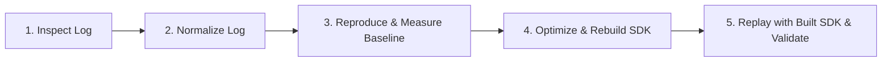

# Improve LSP Performance with Session Logs

This skill guides you through diagnosing slow LSP request/response interactions
in the Dart Analysis Server (DAS), reproducing them with the log player replay
tool, optimizing the server implementation, recompiling the SDK, and validating
the latency improvement.

---

## Workflow Overview



1. **Inspect Log**: Locate target requests (e.g. `textDocument/documentColor`,
   `textDocument/completion`) and calculate request-to-response duration
   (`response.time - request.time`).
2. **Normalize Log**: Replace machine-specific paths with portable placeholders
   (`{{workspaceFolder-0}}`, `{{dartSdkRoot}}`).
3. **Reproduce Baseline**: Replay the log against the baseline server using
   `server_driver_main.dart` or automated playback, isolating warm request
   latency from cold-start queueing.
4. **Optimize Code**: Implement performance improvements in `pkg/analysis_server`
   or `pkg/analyzer`.
5. **Recompile SDK**: From `<sdk-root>`, run `python3 tools/build.py -mrelease create_sdk`.
6. **Replay with the freshly built SDK**: Replay using the newly compiled `dart` binary to
   verify latency reduction and correctness.
7. **Run unit and integration tests**: Run existing unit tests and add regression tests for
   modified logic.

## Step 1: Inspect the session communications log

Session logs are line-delimited JSON (JSON Lines). Each line is an independent
JSON object containing `time` and `kind`. Depending on the kind of entry (e.g.
`message` versus `commandLine`), lines may also have `sender`, `receiver`, and
`message` (though some entries might omit them).

### Analyze the Log with `analyze_session_log.dart`

The skill provides
[`scripts/analyze_session_log.dart`](scripts/analyze_session_log.dart) to parse,
inspect, and summarize session logs automatically:

```bash
dart <sdk-root>/pkg/analysis_server/.agents/skills/improve-performance-with-session-log/scripts/analyze_session_log.dart \
  [--method=<name>] [--min-ms=<ms>] [--warm-only] [--summary] <path_to_session_log>
```

Key capabilities:

* **Measures Client & Server Durations**: Displays client-perceived duration
  (`response.time - request.clientRequestTime`) and server processing duration
  (`response.time - request.time`).
* **Detects Cold-Start Queueing**: Identifies whether requests occurred during
  initial background analysis (`$/progress` `"Analyzing..."`) or against a warm
  server.
* **Extracts Errors & Crashes**: Automatically parses and surfaces server
  exceptions (e.g. `Bad state: SimpleIdentifierImpl is not in the V2 AST view`).

Example of inspecting 'textDocument/documentColor' requests in a session:

```bash
dart <sdk-root>/pkg/analysis_server/.agents/skills/improve-performance-with-session-log/scripts/analyze_session_log.dart \
  -m documentColor session-log-2.txt
```

## Step 2: Normalize the Log

Raw session logs contain absolute paths from the machine where they were
recorded. Normalize them to make them replayable against any local workspace:

```bash
dart <sdk-root>/pkg/analysis_server/tool/log_player/normalize.dart \
  -i <path/to/raw_log.json> \
  -o <path/to/normalized_log.json> \
  -r <path/to/project/root> \
  [-p <path/to/.dart_tool/package_config.json>]
```

Options:

* `-i`, `--input`: Path to the raw recorded log file.
* `-o`, `--output`: Destination path for the normalized log.
* `-r`, `--root-dir`: Root directory of the project open during recording.
* `-p`, `--package-config`: (Optional) Explicit path to `package_config.json`
  if not at `<root-dir>/.dart_tool/package_config.json`.

Normalizing replaces machine paths with `{{workspaceFolder-0}}`,
`{{dartSdkRoot}}`, and package URIs with `{{package-root:...}}`.

---

## Step 3: Reproduce and Measure Baseline Latency

### Automated Replay & Measurement (`measure_request_latency.dart`)

The skill provides
[`scripts/measure_request_latency.dart`](scripts/measure_request_latency.dart)
to automatically replay setup messages up to a target request, wait for
background analysis to finish, and measure wall-clock latency across multiple
iterations:

```bash
dart <sdk-root>/pkg/analysis_server/.agents/skills/improve-performance-with-session-log/scripts/measure_request_latency.dart \
  -i <request_id> -w <path/to/workspace> -r 3 <path/to/normalized_log.json>
```

Options:

* `-i`, `--request-id`: (**Required**) The target request ID identified in Step 1
  (e.g. `153`). Always specify this to ensure you benchmark the exact target
  request.
* `-m`, `--method`: Target request method (e.g. `textDocument/documentColor`).
  Avoid using this without `-i`, as matching by method alone yields the first
  occurrence in the log rather than the slowest or target request.
* `-w`, `--workspace`: Local project directory to map `{{workspaceFolder-0}}`
  to (defaults to current working directory).
* `-r`, `--repeat`: Number of iterations to measure consistency (default: 1).

> [!IMPORTANT]
> **Always use `--request-id` (`-i`)**: Pass the specific request ID found from
> inspecting or analyzing the log in Step 1. Do not rely on `--method` alone:
> `--method` only matches the *first* occurrence of that method in the session
> log, which is often a fast initial request rather than the slow interaction
> you are trying to optimize.

### Interactive replay (`server_driver_main.dart`)

For manual inspection and stepping through messages one-by-one:

```bash
cd /path/to/project/root
dart <sdk-root>/pkg/analysis_server/tool/log_player/server_driver_main.dart /path/to/normalized_log.json
```

* Press **Enter** to step through messages.
* Wait for background analysis to finish (`$/progress` `{"kind": "end"}`) before
  stepping to the target request to measure warm handler latency.

**Note** that this tool can absolutely change the timing of the operations in
the log, which can potentially change the **behavior** of the server.

## Step 4: Investigate code and implement optimizations

1. Identify the handler or computer responsible for the request method:
   * Method `textDocument/documentColor` $\to$
     `pkg/analysis_server/lib/src/lsp/handlers/handler_document_color.dart` and
     `pkg/analysis_server/lib/src/computer/computer_color.dart`.
   * Method `textDocument/completion` $\to$
     `pkg/analysis_server/lib/src/lsp/handlers/handler_completion.dart` and
     `pkg/analysis_server/lib/src/services/completion/`.
   * Method `textDocument/codeAction` $\to$
     `pkg/analysis_server/lib/src/lsp/handlers/handler_code_actions.dart`.
2. Inspect profiling data or trace execution paths for common bottlenecks:
   * **Unnecessary AST traversals**: Are visitors walking AST subtrees that
     cannot contain relevant nodes?
   * **Excessive element resolution or type evaluation**: Can lightweight
     syntactic checks filter out candidates before resolving types or evaluating
     constant values?
   * **Repeated allocations or computations**: Can maps/sets be reused, or early
     exits added?
3. Apply optimizations in `pkg/analysis_server` or `pkg/analyzer`.

## Step 5: Recompile the Dart SDK

Recompile the analysis server snapshot and SDK binaries:

```bash
(cd <sdk-root> && python3 tools/build.py -mrelease create_sdk)
```

The compiled SDK binaries will be located at:

* **macOS**: `xcodebuild/ReleaseARM64/dart-sdk/bin/dart` (or
  `xcodebuild/ReleaseX64/...`)
* **Linux / Windows**: `out/ReleaseX64/dart-sdk/bin/dart`

## Step 6: Replay with the freshly built SDK

> [!IMPORTANT]
> `ServerDriver` starts the server process using `Platform.resolvedExecutable`.
> To run against your freshly built changes, you **must** execute `server_driver_main.dart` (or your replay script) using the compiled `dart` binary, not the system `dart`.

### Running automated replay with the built SDK

Run `measure_request_latency.dart` with the compiled binary to measure latency after changes:

```bash
<built-sdk-dart> \
  <sdk-root>/pkg/analysis_server/.agents/skills/improve-performance-with-session-log/scripts/measure_request_latency.dart \
  -i <request_id> -w <path/to/workspace> -r 3 /path/to/normalized_log.json
```

### Interactive stepping with the built SDK

```bash
<built-sdk-dart> \
  <sdk-root>/pkg/analysis_server/tool/log_player/server_driver_main.dart \
  /path/to/normalized_log.json
```

If running from an external project root and package resolution fails, specify
the package config:

```bash
--packages=<sdk-root>/.dart_tool/package_config.json
```

### Validation checklist

- [ ] Confirm the target request returns the exact same valid response payload
      (colors, completions, etc.).
- [ ] Verify that request execution latency is substantially reduced compared to
      baseline.
- [ ] Confirm no unhandled exceptions or error responses are produced in the
      server output stream.

## Step 7: Run unit and integration tests

Run relevant existing tests with the compiled Dart binary:

```bash
<built-sdk-dart> test <sdk-root>/pkg/analysis_server/test/src/...
```

Add new unit tests in the appropriate test suite (e.g.
`pkg/analysis_server/test/src/computer/...`) to lock in the performance
optimization and guard against regressions.
