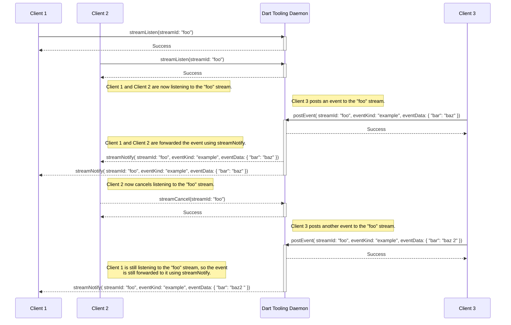
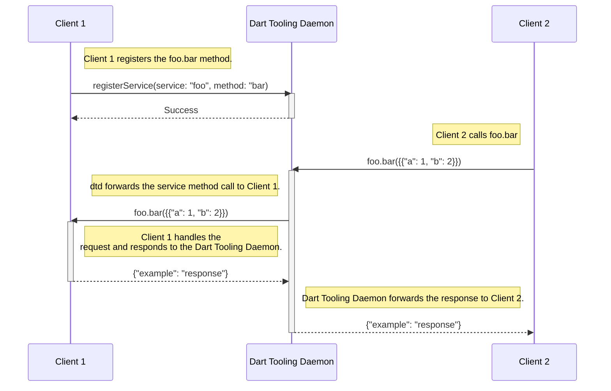

# Overview

This document describes the Dart Tooling Daemon protocol. This daemon, and it's
protocol is meant to facilitate communication channels between various tools.

To start a tooling daemon run `dart tooling-daemon`.

The Dart Tooling Daemon Protocol uses JSON-RPC 2.0.

## Streams

The following is a visualization of normal stream interaction. It is presented in function notation, instead of RPC calls, for brevity.



## Service Methods

The following is a visualization of normal service method interaction. It is presented in function notation, instead of RPC calls, for brevity.



# Interacting with the Dart Tooling Daemon

## package:dtd

[package:dtd](https://pub.dev/packages/dtd) is available for use with Dart.
It facilitates access to the Dart Tooling Daemon, by providing a convenient Dart
interface.

## Dart Tooling Daemon protocol

Alternatively you can interact with the tooling daemon using the RPC protocol
directly.

### `streamListen`

Registers the calling client as listening to the stream named _streamId_.

The calling client will then receive [streamNotify](#streamnotify) calls when
any client calls [postEvent](#postevent) on the _streamId_ stream.

#### Parameters

`String streamId` - The name of the stream to start listening to.

#### Result

If successful responds with [Success](#success).

#### Code Sample

```json
{
  "jsonrpc": "2.0",
  "method": "streamListen",
  "params": {
    "streamId": "foo_stream"
  },
  "id": "2"
}
```

#### Response

```json
{"id": "2", "type": "Success"}
```

### `streamCancel`

Unregisters the calling client from listening to the stream named _streamId_.

The calling client will no longer receive [streamNotify](#streamnotify) method
calls for events on the _streamId_ stream.

#### Parameters

`String streamId` - The name of the stream to stop listening to.

#### Result

If successful responds with [Success](#success).

#### Code Sample

```json
{
  "jsonrpc": "2.0",
  "method": "streamCancel",
  "params": {
    "streamId": "foo_stream"
  },
  "id": "2"
}
```

#### Response

```json
{"id": "2", "type": "Success"}
```

### `postEvent`

Calls [streamNotify](#streamnotify) on all clients that are currently
[streamListen](#streamlisten)ing to the _streamId_ stream.

#### Parameters

- `String streamId` - The stream to post the event to
- `String eventKind` - The kind of event being sent.
- `Map<String, Object?> eventData` - A map object of data to send with the
  event. _eventData_ must be serializable to json.

#### Result

If successful responds with [Success](#success).

#### Code Sample

```json
{
  "jsonrpc": "2.0",
  "method": "postEvent",
  "params": {
    "streamId": "fooStream",
    "eventKind": "bar",
    "eventData": { "bazKey": "apple" }
  },
  "id": "2"
}
```

#### Response

```json
{"id": "2", "type": "Success"}
```

### `registerService`

Registers the calling client as the handler for any service method calls where
the service is _service_ and the method is _method_.

To call the method registered by this call, a client can send a
[service method](#servicemethod) call to the Dart Tooling Daemon.

When a client disconnects, then all of the service methods registered to it are
removed.

#### Parameters

- `String service` - The name of the service to register the client to. Once a
  client has registered a method to a service then only that client can register
  other methods to that service.
- `String method` - The name of the method to register to _service_.

#### Result

If successful responds with [Success](#success).

#### Code Sample

```json
{
  "jsonrpc": "2.0",
  "method": "registerService",
  "params": {
    "service": "foo",
    "method": "bar",
  },
  "id": "2"
}
```

#### Response

```json
{"id": "2", "type": "Success"}
```

### `service`.`method`

Triggers the service method registered by [registerService](#registerservice),
for _service_ and _method_.

Dart Tooling Daemon will forward the service method call to the client that
[registered](#registerservice) it. The client's response will be returned from this
method call.

#### Parameters

The parameters must be a `Map<String, Object?>` where the contents are defined
on a case by case basis on the expectations of the client who registered
the service method.

#### Result

The result is defined on a case by case basis based on the implementer of the
service method.

#### Code Sample

Assume that a client has registered a service method with:

- service: `foo`
- method: `bar`

Then calling that service method might look like:

```json
{
  "jsonrpc": "2.0",
  "method": "foo.bar",
  "params": { "baz": 3 },
  "id": "2"
}
```

#### Response

The response is defined on a case by case basis based on the implementer of the
service method.

## DTD Client Responsibilities

When creating a client that interacts with the Dart Tooling Daemon, implement
the following methods in order to participate in the full lifecycle.

### streamNotify

In order to handle messages posted to streams that the client is
[streamListen](#streamlisten)ing to, then the calling client may handle incoming
`streamNotify` RPC methods.

When any client calls [postEvent](#postevent) for a given _streamId , if a
client has[streamListen](#streamlisten)ed to _streamId_, then that client
will receive `streamNotify` method calls for those events. Implement this method
in order to receive those calls.

#### Parameters

- `String streamId` - The stream to post the event to
- `String eventKind` - The kind of event being sent.
- `Map<String, Object?> eventData` - A map object of data to send with the
  event.

#### Result

No response is given since this is sent as a notification.

#### Code Sample

```json
{
    "jsonrpc": "2.0",
    "method": "streamNotify",
    "params": {
        "streamId": "fooStream",
        "eventKind": "bar",
        "eventData": { "baz": "car" }
    },
    "id": "2"
}
```

#### Response

None, `streamNotify` is called as a notification and expects no response.

### `service`.`method`

Any time the client calls [registerService](#registerservice) then it will
receive method calls for that service method.

The method name will take the form `service`.`method`. Any response returned by
the RPC handler will be forwarded to the service method caller.

#### Parameters

The parameters are defined on a case by case basis based on the expectations of
the client who registered the service method.

#### Result

The result is defined on a case by case basis based on the implementer of the
service method.

#### Code Sample

Assume that a client has registered a service method with:

- service: `foo`
- method: `bar`

Then calling that service method might look like:

```json
{
  "jsonrpc": "2.0",
  "method": "foo.bar",
  "params": { "baz": 3 },
  "id": "2"
}
```

#### Response

The response is defined on a case by case basis based on the implementer of the
service method. It should be a valid RPC response.

# Responses

## Success

Methods that respond with Success do so with the following RPC.

```json
{"id": "2", "type": "Success"}
```
