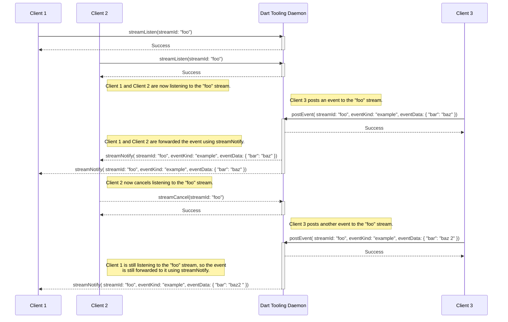
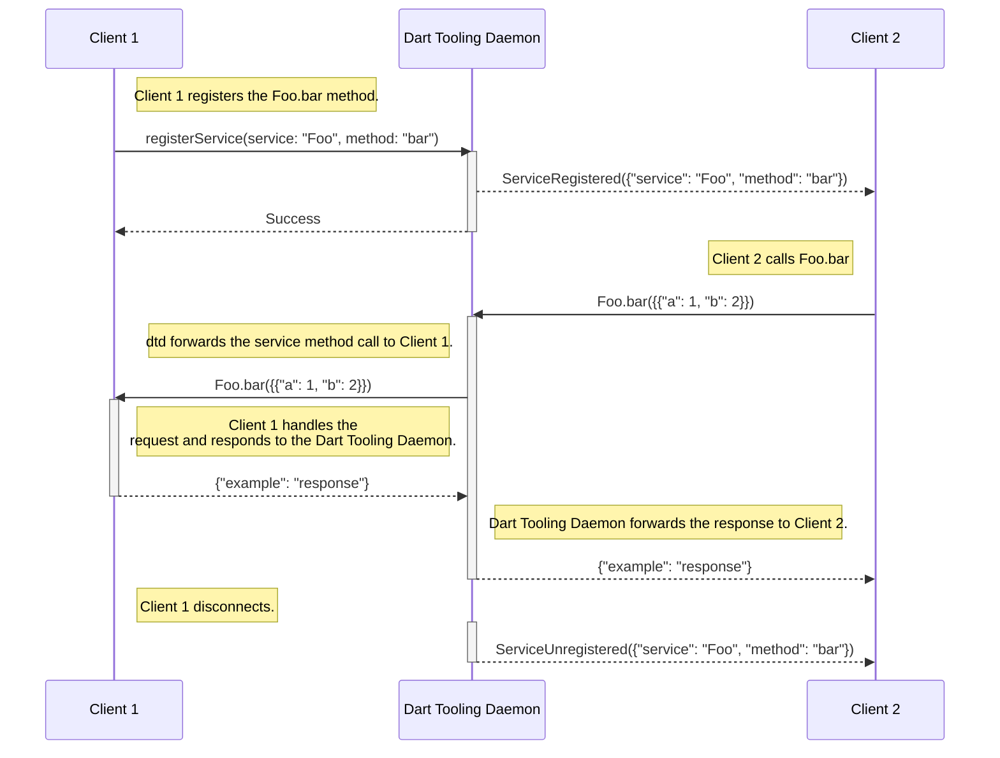

# Dart Tooling Daemon Protocol

This document describes the Dart Tooling Daemon protocol. This daemon, and it's
protocol is meant to facilitate communication channels between various tools.

To start a tooling daemon run `dart tooling-daemon`.

If you have access to `Dart` then you can use the [package:dtd](#packagedtd)
package.

Otherwise, if you are creating your own client that will communicate with DTD
using RPC, make sure to follow the entire
[Dart Tooling Daemon RPC protocol](#dart-tooling-daemon-rpc-protocol) section.

The Dart Tooling Daemon Protocol uses JSON-RPC 2.0.

## Common Services Definitions

Some common services are defined to ensure that different tools can provide the
same functionality consistently to DTD clients. Details of these can be found in
[dtd_common_services](./dtd_common_services.md).

## Visualizing DTD interactions

The following diagrams visualize how the Dart Tooling Daemon interacts with
clients.

### Streams

The following is a visualization of normal stream interaction. It is presented
in function notation, instead of RPC calls, for brevity.



### Service Methods

The following is a visualization of normal service method interaction. It is
presented in function notation, instead of RPC calls, for brevity.



`registerService` takes an optional map of capabilities that can be used for
evolving the service method over time (such as expressing support for additional
named values in the arguments).

```json
{
  "jsonrpc": "2.0",
  "method": "registerService",
  "params": {
    "service": "Foo",
    "method": "bar",
    "capabilities": {
      "supportsAdditionalFoo": true,
    },
  },
  "id": "2"
}
```

Notifications will be sent over a special `Service` stream when services are
registered and unregistered.

```json
{
    "jsonrpc": "2.0",
    "method": "streamNotify",
    "params": {
        "streamId": "Service",
        "eventKind": "ServiceRegistered",
        "eventData": {
          "service": "Foo",
          "method": "bar",
          // Capabilities are included only if the client provided them
          "capabilities": {
            "supportsAdditionalFoo": true,
          },
        }
    },
    "id": "2"
}

{
    "jsonrpc": "2.0",
    "method": "streamNotify",
    "params": {
        "streamId": "Service",
        "eventKind": "ServiceUnregistered",
        "eventData": {
          "service": "Foo",
          "method": "bar",
          // Unregistered events do not contain capabilities
        }
    },
    "id": "2"
}
```

## Dart Tooling Daemon Interaction

### package:dtd

[package:dtd](https://pub.dev/packages/dtd) is available for use with Dart.
It facilitates access to the Dart Tooling Daemon, by providing a convenient Dart
interface.

### Dart Tooling Daemon RPC protocol

To facilitate RPC interaction with the Dart Tooling Daemon, this section lays
out the methods and interactions involved.

If you are implementing a custom client then make sure to follow all of the
parts in this section, including the
[Custom client methods](#custom-client-methods) section.

#### `streamListen`

Registers the calling client as listening to the stream named _streamId_.

The calling client will then receive [streamNotify](#streamnotify) calls when
any client calls [postEvent](#postevent) on the _streamId_ stream.

##### Parameters

`String streamId` - The name of the stream to start listening to.

##### Result

If successful, responds with [Success](#success-responses).

If the client is already subscribed to the stream, the _103_ (Stream already
subscribed) [RPC error](#rpc-errors) code is returned.

##### Code Sample

```json
{
  "jsonrpc": "2.0",
  "method": "streamListen",
  "params": {
    "streamId": "foo_stream"
  },
  "id": "2"
}
```

##### Response

```json
{
  "jsonrpc": "2.0",
  "result": {"type": "Success"},
  "id": "2"
}
```

#### `streamCancel`

Unregisters the calling client from listening to the stream named _streamId_.

The calling client will no longer receive [streamNotify](#streamnotify) method
calls for events on the _streamId_ stream.

##### Parameters

`String streamId` - The name of the stream to stop listening to.

##### Result

If successful, responds with [Success](#success-responses).

If the client is not subscribed to the stream, the _104_ (Stream not
subscribed) [RPC error](#rpc-errors) code is returned.

##### Code Sample

```json
{
  "jsonrpc": "2.0",
  "method": "streamCancel",
  "params": {
    "streamId": "foo_stream"
  },
  "id": "2"
}
```

##### Response

```json
{
  "jsonrpc": "2.0",
  "result": {"type": "Success"},
  "id": "2"
}
```

#### `postEvent`

Calls [streamNotify](#streamnotify) on all clients that are currently
[streamListen](#streamlisten)ing to the _streamId_ stream.

##### Parameters

- `String streamId` - The stream to post the event to
- `String eventKind` - The kind of event being sent.
- `Map<String, Object?> eventData` - A map object of data to send with the
  event. _eventData_ must be serializable to json.

##### Result

If successful, responds with [Success](#success-responses).

##### Code Sample

```json
{
  "jsonrpc": "2.0",
  "method": "postEvent",
  "params": {
    "streamId": "fooStream",
    "eventKind": "bar",
    "eventData": { "bazKey": "apple" }
  },
  "id": "2"
}
```

##### Response

```json
{
  "jsonrpc": "2.0",
  "result": {"type": "Success"},
  "id": "2"
}
```

#### `registerService`

Registers the calling client as the handler for any service method calls where
the service is _service_ and the method is _method_.

Service names may not include dots `.` (though method names may), but service
names cannot be reused across clients. If one client has registered any method
for the service "Foo", then no other client can register a method under the
service "Foo".

To call the method registered by this call, a client can send a
[service method](#servicemethod) call to the Dart Tooling Daemon.

When a client disconnects, then all of the service methods registered to it are
removed.

##### Parameters

- `String service` - The name of the service to register the client to. Once a
  client has registered a method to a service then only that client can register
  other methods to that service.
- `String method` - The name of the method to register to _service_.

##### Result

If successful, responds with [Success](#success-responses).

If the _service_ has already been registered by another client, the _111_
(Service already registered) [RPC error](#rpc-errors) code is returned. Only one
client at a time may register to a [service]. Once a client disconnects then
another client may register services under that name.

If the _method_ has already been registered on the _service_, the _132_
(Service method already registered) [RPC error](#rpc-errors) code is returned.

##### Code Sample

```json
{
  "jsonrpc": "2.0",
  "method": "registerService",
  "params": {
    "service": "Foo",
    "method": "bar",
  },
  "id": "2"
}
```

##### Response

```json
{
  "jsonrpc": "2.0",
  "result": {"type": "Success"},
  "id": "2"
}
```

#### `service`.`method`

Triggers the service method registered by [registerService](#registerservice),
for _service_ and _method_.

Dart Tooling Daemon will forward the service method call to the client that
[registered](#registerservice) it. The client's response will be returned from
this method call.

##### Parameters

The parameters must be a `Map<String, Object?>` where the contents are defined
on a case by case basis on the expectations of the client who registered
the service method.

##### Result

The result is defined on a case by case basis based on the implementer of the
service method.

If service method does not exist, the -32601 (Method not found)
[RPC error](#rpc-errors) code is returned.

##### Code Sample

Assume that a client has registered a service method with:

- service: `Foo`
- method: `bar`

Then calling that service method might look like:

```json
{
  "jsonrpc": "2.0",
  "method": "Foo.bar",
  "params": { "baz": 3 },
  "id": "2"
}
```

##### Response

The response is defined on a case by case basis based on the implementer of the
service method.

#### Custom Client Methods

When creating a client that interacts with the Dart Tooling Daemon, register
the following methods on your client in order to participate in the full
lifecycle.

##### `streamNotify`

In order to handle messages posted to streams that the client is
[streamListen](#streamlisten)ing to, then the calling client may handle incoming
`streamNotify` RPC methods.

When any client calls [postEvent](#postevent) for a given _streamId , if a
client has[streamListen](#streamlisten)ed to _streamId_, then that client
will receive `streamNotify` method calls for those events. Implement this method
in order to receive those calls.

###### Parameters

- `String streamId` - The stream to post the event to
- `String eventKind` - The kind of event being sent.
- `Map<String, Object?> eventData` - A map object of data to send with the
  event.

###### Result

No response is given since this is sent as a notification.

###### Code Sample

```json
{
    "jsonrpc": "2.0",
    "method": "streamNotify",
    "params": {
        "streamId": "fooStream",
        "eventKind": "bar",
        "eventData": { "baz": "car" }
    },
    "id": "2"
}
```

###### Response

None, `streamNotify` is called as a notification and expects no response.

##### `service.method`

Any time the client calls [registerService](#registerservice) then it will
receive method calls for that service method.

The method name will take the form `service`.`method`. Any response returned by
the RPC handler will be forwarded to the service method caller.

###### Parameters

The parameters are defined on a case by case basis based on the expectations of
the client who registered the service method.

###### Result

The result is defined on a case by case basis based on the implementer of the
service method.

###### Code Sample

Assume that a client has registered a service method with:

- service: `Foo`
- method: `bar`

Then calling that service method might look like:

```json
{
  "jsonrpc": "2.0",
  "method": "Foo.bar",
  "params": { "baz": 3 },
  "id": "2"
}
```

###### Response

The response is defined on a case by case basis based on the implementer of the
service method. It should be a valid RPC response.


## FileSystem service

The `FileSystem` service is coupled tightly with the Dart Tooling Daemon, and
will be present immediately when the Dart Tooling Daemon has started. This
describes the RPC methods used to interact with the `FileSystem` service.

### readFileAsString

Reads the contents of the file at _uri_ on the system where the Dart Tooling
Daemon is running.

#### Parameters

- `String uri` - An absolute path to the file to read. This should be using the
  'file' scheme and be an absolute path.

#### Result

If successful, responds with [_FileContent_](#filecontent).

If the file at _uri_ does not exist, the 141 (The file does not exist)
[RPC error](#rpc-errors) code is returned.

If the _uri_ is not contained in the
[IDE Workspace Roots](#ide-workspace-roots), the 142
(Permission denied) [RPC error](#rpc-errors) code is returned.

If _uri_ does not have a 'file' scheme, the 143 (File scheme expected on uri)
[RPC error](#rpc-errors) code is returned.

#### Code Sample

```json
{
    "jsonrpc": "2.0",
    "method": "FileSystem.readFileAsString",
    "params": {
        "uri": "file:///path/to/file.txt",
    },
    "id": "2"
}
```

#### Response

```json
{
  "jsonrpc": "2.0",
  "result": {
    "type": "FileContent",
    "content": "The contents\nof the file",
  },
  "id": "2"
}
```

### writeFileAsString

Writes the contents of the file at _uri_ on the system where the Dart
Tooling Daemon is running. If the file, or parent directories don't exist then
they are created.

#### Parameters

- `String uri` - An absolute path to the file to read. This should be using the
  'file' scheme and be an absolute path.
- `String contents` - The content to write to _uri_.

#### Result

If successful, responds with [Success](#success-responses).

If the _uri_ is not contained in the
[IDE Workspace Roots](#ide-workspace-roots), the 142
(Permission denied) [RPC error](#rpc-errors) code is returned.

If _uri_ does not have a 'file' scheme, the 143 (File scheme expected on uri)
[RPC error](#rpc-errors) code is returned.

#### Code Sample

```json
{
    "jsonrpc": "2.0",
    "method": "FileSystem.writeFileAsString",
    "params": {
        "uri": "file:///path/to/file.txt",
        "contents": "Some contents to write",
    },
    "id": "2"
}
```

#### Response

```json
{
  "jsonrpc": "2.0",
  "result": {"type": "Success"},
  "id": "2"
}
```

### listDirectoryContents

Reads the entries of the directory at _uri_ on the system where the Dart Tooling
Daemon is running.

#### Parameters

- `String uri` - An absolute path to the file to read. This should be using the
  'file' scheme and be an absolute path.

#### Result

If successful, responds with [_UriList_](#urilist).

If the _uri_ is not contained in the
[IDE Workspace Roots](#ide-workspace-roots), the 142
(Permission denied) [RPC error](#rpc-errors) code is returned.

If _uri_ does not have a 'file' scheme, the 143 (File scheme expected on uri)
[RPC error](#rpc-errors) code is returned.

#### Code Sample

```json
{
    "jsonrpc": "2.0",
    "method": "FileSystem.listDirectoryContents",
    "params": {
        "uri": "file:///path/to/dir/",
    },
    "id": "2"
}
```

#### Response

```json
{
  "jsonrpc": "2.0",
  "result": {
    "type": "UriList",
    "uris": [
      "file:///path/to/dir/a.txt",
      "file:///path/to/dir/b/",
    ],
  },
  "id": "2"
}
```

### IDE Workspace Roots

The IDE workspace roots are used to ensure the the `FileSystem` service methods
do not perform file operations in areas outside of the IDE workspace roots.

When the Dart Tooling Daemon is started, a secret is generated and presented to
the process that started the Dart Tooling Daemon. That secret is then used to
authenticate when calling [setIDEWorkspaceRoots](#setideworkspaceroots). This
ensures that the process that started the Dart Tooling Daemon is the one setting
the IDE workspace root.

Once the IDE workspace roots are set then `FileSystem` service methods will be
limited to those workspace directories. Any operations outside of them will
result with the 142 (Permission denied) [RPC error](#rpc-errors) code.

If no workspace roots are set then all `FileSystem` service method calls will
fail with the 142 (Permission denied) [RPC error](#rpc-errors) code.

#### setIDEWorkspaceRoots

##### Parameters

- `String secret` - The secret that was passed back to the calling process when
  the Dart Tooling Daemon was started.
- `List<String> roots` - The directories to set as the IDE workspace roots.
  These must be uris with a 'file' scheme.

##### Result

If successful, responds with [Success](#success-responses).

If _secret_ does not match the secret created when Dart Tooling Daemon was
created then 142 (Permission denied) [RPC error](#rpc-errors) code is returned.

If one of the _roots_ is missing a 'file' scheme, the 143 (File scheme expected on uri)
[RPC error](#rpc-errors) code is returned.

##### Code Sample

```json
{
    "jsonrpc": "2.0",
    "method": "FileSystem.setIDEWorkspaceRoots",
    "params": {
        "secret": "aBVsK8nRfdJsDEnS",
        "roots": [
          "file:///path/to/dir/a/",
          "file:///path/to/dir/b/",
        ],
    },
    "id": "2"
}
```

##### Response

```json
{
  "jsonrpc": "2.0",
  "result": {"type": "Success"},
  "id": "2"
}
```

#### getIDEWorkspaceRoots

Used to get the IDE workspace roots that have been set using
[setIDEWorkspaceRoots](#setideworkspaceroots).

##### Parameters

Takes no parameters.

##### Result

If successful, responds with [_IDEWorkspaceRoots_](#ideworkspaceroots).

##### Code Sample

```json
{
    "jsonrpc": "2.0",
    "method": "FileSystem.getIDEWorkspaceRoots",
    "params": {},
    "id": "2"
}
```

##### Response

```json
{
  "jsonrpc": "2.0",
  "result": {
    "type": "IDEWorkspaceRoots",
    "ideWorkspaceRoots":: [
      "file:///path/to/dir/a/",
      "file:///path/to/dir/b/",
    ],
  },
  "id": "2"
}
```

#### getProjectRoots

Used to get the project roots contained within the current set of IDE workspace roots
(see [setIDEWorkspaceRoots](#setideworkspaceroots) and
[getIDEWorkspaceRoots](#getideworkspaceroots)). A project root is any directory that
contains a `pubspec.yaml` file.

##### Parameters

- `int depth` - The depth that each IDE workspace root directory tree will be searched
  for project roots. Defaults to 4.

##### Result

If successful, responds with [_UriList_](#urilist).

##### Code Sample

```json
{
    "jsonrpc": "2.0",
    "method": "FileSystem.getProjectRoots",
    "params": {"depth": 5},
    "id": "2"
}
```

##### Response

```json
{
  "jsonrpc": "2.0",
  "result": {
    "type": "UriList",
    "uris": [
      "file:///path/to/dir/a/",
      "file:///path/to/dir/b/",
    ],
  },
  "id": "2"
}
```

### File System Service Types

The File System Service Types are RPC data responses used to facilitate
communication with the `FileSystem` service methods. They are used by
[pkg/dtd_impl](./) and [`package:dtd`](../pkg/) to build and parse responses for
the different service methods.

#### `UriList`

Response for communicating a list of URIs.

The returned uris will be `file://` Uris.

Used by `FileSystem.listDirectoryContents`, and `FileSystem.getProjectRoots`.

```json
{
  "type": "UriList",
  "uris": [
    "file:///path/to/file.txt",
    "file:///path/to/dir/",
  ],
}
```

#### `FileContent`

Response for communicating the contents of a file.

Used by `FileSystem.readFileAsString`

```json
{
  "type": "FileContent",
  "content": "The contents of a file.",
}
```

#### `IDEWorkspaceRoots`

Response for communicating workspace roots.

The returned uris will be `file://` Uris.

Used by `FileSystem.getIDEWorkspaceRoots`

```json
{
  "type": "IDEWorkspaceRoots",
  "ideWorkSpaceRoots": [
    "file:///path/to/root/A/",
    "file:///path/to/root/B/",
  ],
}
```

## DTD RPC Responses

### RPC Errors

When a request to Dart Tooling Daemon encounters an error, it is provided in the _error_
property of the response object. JSON-RPC errors always provide
_code_, _message_, and _data_ properties.

Here is an example error response for our [streamListen](#streamlisten)
request above. This error would be generated if we were attempting to
subscribe to the _GC_ stream multiple times from the same client.

```json
{
  "jsonrpc": "2.0",
  "error": {
    "code": 103,
    "message": "Stream already subscribed",
    "data": {
      "details": "The stream 'GC' is already subscribed"
    }
  },
  "id": "2"
}
```

In addition to the
[error codes](http://www.jsonrpc.org/specification#error_object) specified in
the JSON-RPC spec, we use the following application specific error codes:
code | message | meaning
---- | ------- | -------
-32601 | Method not found | The method does not exist / is not available.
-32602 | Invalid params | Invalid params. Invalid method parameter(s).
103 | Stream already subscribed | The client is already subscribed to the specified _streamId_.
104 | Stream not subscribed | The client is not subscribed to the specified _streamId_.
111 | Service already registered | Service with such name has already been registered by this client.
112 | Service disappeared | Failed to fulfill service request, likely service handler is no longer available.
132 | Service method already registered | Method for the given service has already been registered by this client.
140 | The directory does not exist | The specified directory does not exist.
141 | The file does not exist | The specified file does not exist.
142 | Permission denied | Permission has been denied for the requested action.
143 | File scheme expected on uri | The uri parameter should be passed as a uri with a file scheme.

 Success Responses

Methods that respond with `Success` do so with the following RPC.

```json
{"id": "2", "type": "Success"}
```
