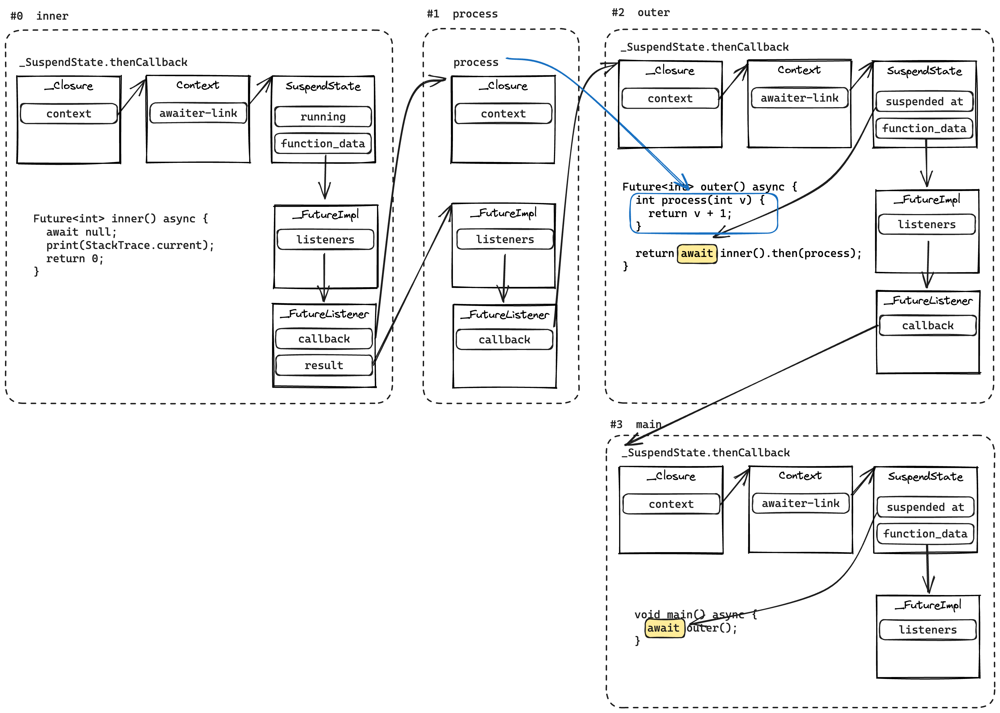

# Awaiter Stack Traces

One of the common challenges associated with debugging asynchronous code is that stack traces do not reference the code which led to the exception. The context is lost when execution cross asynchronous gap.

Consider the following code:

```dart
Future<int> inner() async {
  await null;  // asynchronous gap
  print(StackTrace.current); // (*)
  return 0;
}

Future<int> outer() async {
  int process(int v) {
    return v + 1;
  }

  return await inner().then(process);
}

void main() async {
  await outer();
}
```

Producing synchronous stack trace at the line marked `(*)` will yield the following:

```
#0 inner
#1 _SuspendState._createAsyncCallbacks.thenCallback
#2 _RootZone.runUnary
#3 _SuspendState._awaitNotFuture.run
#4 _microtaskLoop
#5 _startMicrotaskLoop
#6 _startMicrotaskLoop
#7 _runPendingImmediateCallback
#8 _RawReceivePort._handleMessage
```

Only a single frame corresponds to user code (`#0  inner`) and the rest are `dart:async` internals. Nothing in this stack trace mentions `outer` or `main`, which called `inner`. This makes diagnosing issues based on a stack trace much harder.

To address this problem runtime system augments synchronous portion of the stack trace with an _awaiter stack trace_. Each awaiter frame represents a closure or a suspended `async` function which will be invoked when the currently running asynchronous computation completes.

This support allows runtime system to produce the following output for the example given above:

```
#0  inner
<asynchronous suspension>
#1  outer.process
<asynchronous suspension>
#2  outer
<asynchronous suspension>
#3  main
<asynchronous suspension>
```

## Algorithm

To recover awaiter stack trace runtime follows through a chain of `_Future`, `_StreamController` and `SuspendState` objects. The following diagram illustrates the path it takes to produce asynchronous stack trace in our initial example:



Each awaiter frame is a pair of `(closure, nextFrame)`:

* `closure` is a listener which will be invoked when the future this frame is waiting on completes.
  * This might be one of the callbacks associated with [suspendable functions](async.md) internals, e.g. `_SuspendState.thenCallback` which resumes execution after the `await`.
* `next` is an object representing the next awaiter frame, which is waiting for the completion of this awaiter frame.

Unwinding rules can be summarised as follows:

* If at any point `closure` has a captured variable marked with `@pragma('vm:awaiter-link')` variable then the value of that variable will be used as `nextFrame`.
* If `nextFrame` is a `_SuspendState` then `_SuspendState.function_data` gives us `_FutureImpl` or `_AsyncStarStreamController` to look at.
* If `nextFrame` is `_FutureImpl` then we can take the first `_FutureListener` in `listeners` and then the next frame is `(listener.callback, listener.result)`.
* If `nextFrame` is `_AsyncStarStreamController` then we get  `asyncStarStreamController.controller.subscription._onData`, which should give us an instance of `_StreamIterator`, which inside contains a `_FutureImpl` on which `await for` is waiting.

Awaiter unwinding is implemented in by [`dart::StackTraceUtils::CollectFrames`] in [`runtime/vm/stack_trace.cc`].

### `@pragma('vm:awaiter-link')`

Dart code which does not use `async`/`async*` functions and instead uses callbacks and lower-level primitives can integrate with awaiter frame unwinding by annotating variables which link to the next awaiter frame with `@pragma('vm:awaiter-link')`.

Consider the following variation of the example:

```dart
Future<int> outer() {
  final completer = Completer<int>();

  int process(int v) {
    completer.complete(v);
  }

  inner().then(v);

  return completer.future;
}
```

Running this would produce the following stack trace:

```
#0 inner
<asynchronous suspension>
#1 outer.process
<asynchronous suspension>
```

Runtime is unable to unwind the awaiter stack past `process`. However if `completer` is annotated with `@pragma('vm:awaiter-link')` then unwinder will know where to continue:

```dart
Future<int> outer() {
  @pragma('vm:awaiter-link')
  final completer = Completer<int>();
  // ...
}
```

```
#0      inner
<asynchronous suspension>
#1      outer.process
<asynchronous suspension>
#2      main
<asynchronous suspension>
```

`vm:awaiter-link` can be used in `dart:async` internals to avoid hardcoding recognition of specific methods into the runtime system, see for example `_SuspendState.thenCallback` or `Future.timeout` implementations.