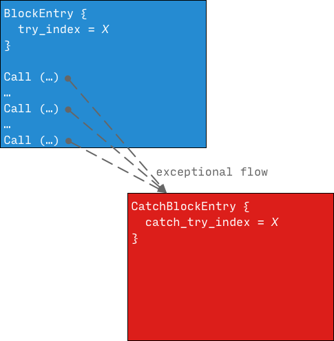
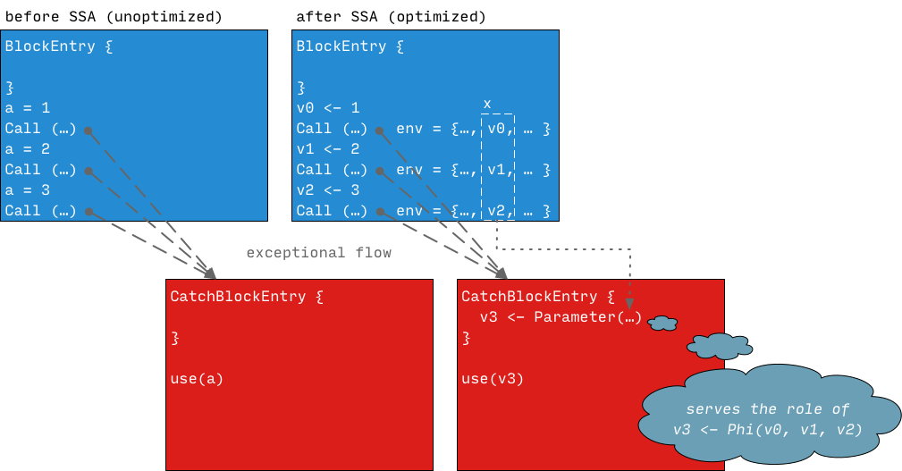

# Exceptions Implementation

This page describes how exceptions throwing and catching is implemented in the
VM.

## Intermediate Language

Dart VM's IL **does not** explicitly represent exceptional control flow in its
flow graph, there are **no** explicit exceptional edges connecting potentially
throwing instructions (e.g. calls) with corresponding catch blocks. Instead this
connection is defined at the block level: all exceptions that occur in any block
with the given `try_index` will be caught by `CatchBlockEntry` with the equal
`catch_try_index`.

For optimized code this means that data flow associated with exceptional control
flow is also represented implicitly: due to the absence of explicit exceptional
edges the data flow can't be represented using explicit phi-functions. Instead
in optimized code each `CatchBlockEntry` is treated almost as if it was an
independent entry into the function: for each variable `v` `CatchBlockEntry`
will contain a `Parameter(...)` instruction restoring variable state at catch
entry from a fixed location on the stack. When an exception is thrown runtime
system takes care of populating these stack slots with right values - current
state of corresponding local variables. It's easy to see a parallel between
these `Parameter(...)` instructions and `Phi(...)` instructions that would be
used if exception control flow would be explicit.

How does runtime system populate stack slots corresponding to these
`Parameter(...)` instructions? During compilation necessary information is
available in _deoptimization environment_ attached to the instruction. This
environment encodes the state of local variables in terms of SSA values i.e. if
we need to reconstruct unoptimized frame which SSA value should be stored into
the given local variable (see [Optimized
IL](compiler-pipeline-overview.md#optimized-il) for
an overview). However the way we use these information for exception handling is
slightly different in JIT and AOT modes.

### AOT mode

AOT mode does not support deoptimization and thus AOT compiler does not
associate any deoptimization metadata with generated code. Instead
deoptimization environments associated with instructions that can throw are
converted into `CatchEntryMoves` metadata during code generation and resulting
metadata is stored `RawCode::catch_entry_moves_maps_` in a compressed form.

`CatchEntryMoves` is essentially a sequence of moves which runtime needs to
perform to create the state that catch entry expects. There are three types of
moves:

* `*(FP + Dst) <- ObjectPool[PoolIndex]` - a move of a constant from an object
pool;
* `*(FP + Dst) <- *(FP + Src)` - a move of a tagged value;
* `*(FP + Dst) <- Box<Rep>(*(FP + Src))` - a boxing operation for an untagged
value;

When an exception is caught runtime decompresses the metadata associated with the
call site which has thrown an exception and uses it to prepare the state of the
stack for the catch block entry. See
`ExceptionHandlerFinder::{ReadCompressedCatchEntryMoves, ExecuteCatchEntryMoves}`.

NOTE: See [this
design/motivation](https://docs.google.com/a/google.com/document/d/1_vX8VkvHVA1Om7jjONiWLA325k_JmSZuvVClet-x-xM/edit?usp=sharing)
document for `CatchEntryMoves` metadata

### JIT mode

JIT mode heavily relies on deoptimization and all call instructions have (lazy)
deoptimization environments associated with them. These environments are
converted to [deoptimization
instructions](deoptimization.md#in-optimized-code)
during code generation and stored on the `Code` object.

When an exception is caught the runtime system converts deoptimization
environment associated with the call site that threw an exception into
`CatchEntryMoves` and then uses it to prepare the state of the stack for the
catch block entry. See `ExceptionHandlerFinder::{GetCatchEntryMovesFromDeopt, ExecuteCatchEntryMoves}`.

Constructing `CatchEntryMoves` dynamically from deoptimization instructions
allows to avoid unnecessary duplication of the metadata and save memory: as
deoptimization environments contain all information necessary for constructing
correct stack state.