# Introduction to Dart VM


!!! WARNING
    This document is work in progress and is currently being written. Please contact Vyacheslav Egorov ([by mail](vegorov@google.com) or [@mraleph](http://twitter.com/mraleph)) if you have any questions, suggestions, bug reports. **Last update: January 29 2020**

!!! sourcecode "Purpose of this document"
    This document is intended as a reference for new members of the Dart VM team, potential external contributors or just anybody interested in VM internals. It starts with a high-level overview of the Dart VM and then proceeds to describe various components of the VM in more details.

Dart VM is a collection of components for executing Dart code natively. Notably it includes the following:

* Runtime System
    * Object Model
    * Garbage Collection
    * Snapshots
* Core libraries native methods
* Development Experience components accessible via *service protocol*
        * Debugging
        * Profiling
        * Hot-reload
* Just-in-Time (JIT) and Ahead-of-Time (AOT) compilation pipelines
* Interpreter
* ARM simulators

The name "Dart VM" is historical. Dart VM is a virtual machine in a sense that it provides an execution environment for a high-level programming language, however it does not imply that Dart is always interpreted or JIT-compiled, when executing on Dart VM. For example, Dart code can be compiled into machine code using Dart VM AOT pipeline and then executed within a stripped version of the Dart VM, called *precompiled runtime*, which does not contain any compiler components and is incapable of loading Dart source code dynamically.

## How does Dart VM run your code?

Dart VM has multiple ways to execute the code, for example:

* from source or Kernel binary using JIT;
* from snapshots:
    * from AOT snapshot;
    * from AppJIT snapshot.

However the main difference between these lies in when and how VM converts Dart source code to executable code. The runtime environment that facilitates the execution remains the same.

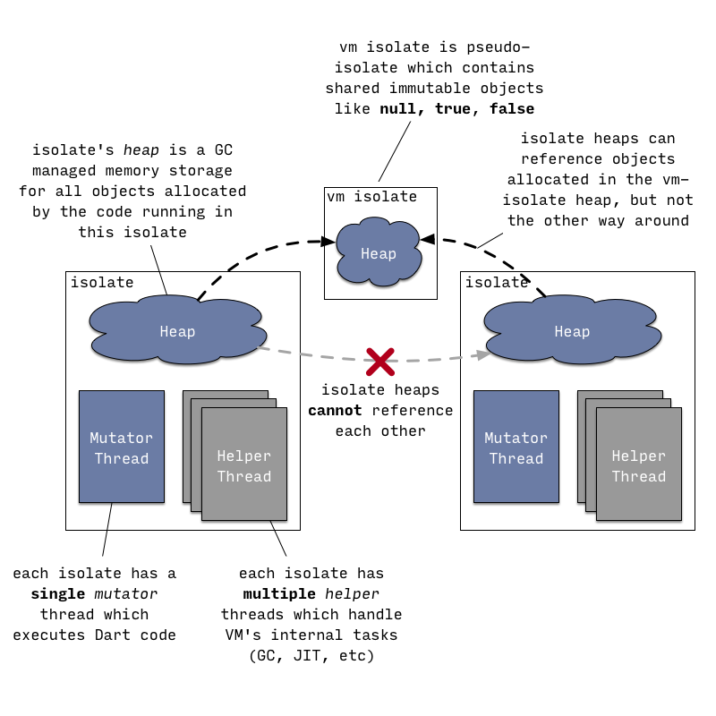

Any Dart code within the VM is running within some _isolate_, which can be best described as an isolated Dart universe with its own memory (*heap*) and _usually_ with its own thread of control (*mutator thread*). There can be many isolates executing Dart code concurrently, but they cannot share any state directly and can only communicate by message passing through *ports* (not to be confused with network ports!).

The relationship between OS threads and isolates is a bit blurry and highly dependent on how VM is embedded into an application. Only the following is guaranteed:

* an OS thread can *enter* only one isolate at a time. It has to leave current isolate if it wants to enter another isolate;
* there can only be a single *mutator* thread associated with an isolate at a time. Mutator thread is a thread that executes Dart code and uses VM's public C API.

However the same OS thread can first enter one isolate, execute Dart code, then leave this isolate and enter another isolate. Alternatively many different OS threads can enter an isolate and execute Dart code inside it, just not simultaneously.

In addition to a single *mutator* thread an isolate can also be associated with multiple helper threads, for example:

* a background JIT compiler thread;
* GC sweeper threads;
* concurrent GC marker threads.

Internally VM uses a thread pool (@{dart::ThreadPool}) to manage OS threads and the code is structured around @{dart::ThreadPool::Task} concept rather than around a concept of an OS thread. For example, instead of spawning a dedicated thread to perform background sweeping after a GC VM posts a @{dart::ConcurrentSweeperTask} to the global VM thread pool and thread pool implementation either selects an idling thread or spawns a new thread if no threads are available. Similarly the default implementation of an event loop for isolate message processing does not actually spawn a dedicated event loop thread, instead it posts a @{dart::MessageHandlerTask} to the thread pool whenever a new message arrives.

!!! sourcecode "Source to read"
    Class @{dart::Isolate} represents an isolate, class @{dart::Heap} - isolate's heap. Class @{dart::Thread} describes the state associated with a thread attached to an isolate. Note that the name `Thread` is somewhat confusing because all OS threads attached to the same isolate as a mutator would reuse the same `Thread` instance. See @{Dart_RunLoop} and @{dart::MessageHandler} for the default implementation of an isolate's message handling.

### Running from source via JIT.

This section tries to cover what happens when you try to execute Dart from the command line:

```dart
// hello.dart
main() => print('Hello, World!');
```

```console
$ dart hello.dart
Hello, World!
```

Since Dart 2 VM no longer has the ability to directly execute Dart from raw source, instead VM expects to be given _Kernel binaries_ (also called _dill files_) which contain serialized [Kernel ASTs][what-is-kernel]. The task of translating Dart source into Kernel AST is handled by the [common front-end (CFE)][pkg-front_end] written in Dart and shared between different Dart tools (e.g. VM, dart2js, Dart Dev Compiler).

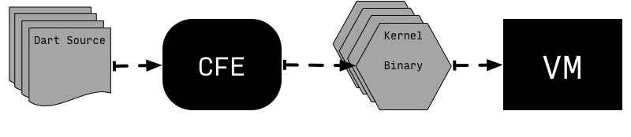

To preserve convenience of executing Dart directly from source standalone `dart` executable hosts a helper isolate called *kernel service*, which handles compilation of Dart source into Kernel. VM then would run resulting Kernel binary.

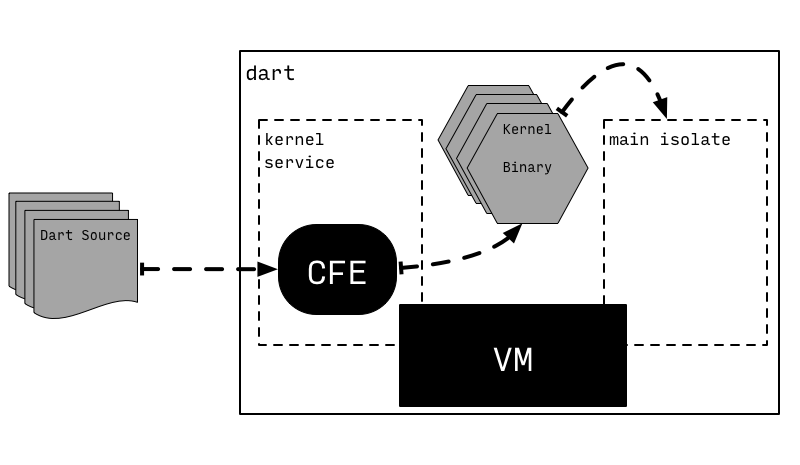

However this setup is not the only way to arrange CFE and VM to run Dart code. For example, Flutter completely separates _compilation to Kernel_ and _execution from Kernel_ by putting them onto different devices: compilation happens on the developer machine (_host_) and execution is handled on the target mobile _device_, which receives Kernel binaries send to it by `flutter` tool.

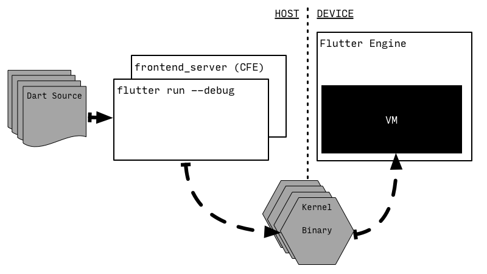

Note that `flutter` tool does not handle parsing of Dart itself - instead it spawns another persistent process `frontend_server`, which is essentially a thin wrapper around CFE and some Flutter specific Kernel-to-Kernel transformations. `frontend_server` compiles Dart source into Kernel files, which `flutter` tool then sends to the device. Persistence of the `frontend_server` process comes into play when developer requests _hot reload_: in this case `frontend_server` can reuse CFE state from the previous compilation and recompile just libraries which actually changed.

Once Kernel binary is loaded into the VM it is parsed to create objects representing various program entities. However this is done lazily: at first only basic information about libraries and classes is loaded. Each entity originating from a Kernel binary keeps a pointer back to the binary, so that later more information can be loaded as needed.

<aside>We use `Raw...` prefix whenever we talk about specific objects allocated internally by the VM. This follows VM own naming convention: layout of internal VM objects is defined using C++ classes with names starting with `Raw` in the header file @{runtime/vm/raw_object.h}. For example, @{dart::RawClass} is a VM object describing Dart class, @{dart::RawField} is a VM object describing a Dart field within a Dart class and so on. We will return to this in a section covering runtime system and object model.</aside>

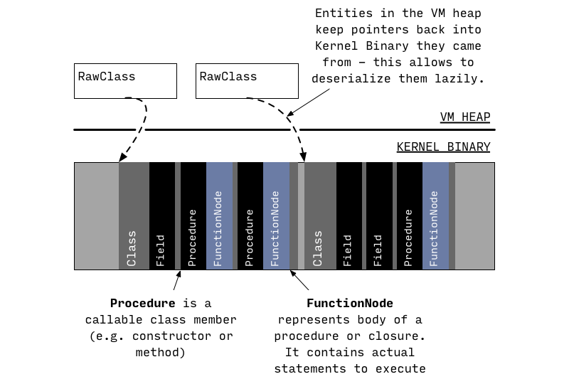

Information about the class is fully deserialized only when runtime later needs it (e.g. to lookup a class member, to allocate an instance, etc). At this stage class members are read from the Kernel binary. However full function bodies are not deserialized at this stage, only their signatures.

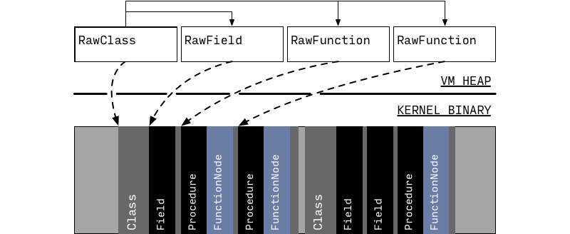

At this point enough information is loaded from Kernel binary for runtime to successfully resolve and invoke methods. For example, it could resolve and invoke `main` function from a library.

!!! sourcecode "Source to read"
    @{package:kernel/ast.dart} defines classes describing the Kernel AST. @{package:front_end} handles parsing Dart source and building Kernel AST from it. @{dart::kernel::KernelLoader::LoadEntireProgram} is an entry point for deserialization of Kernel AST into corresponding VM objects. @{pkg/vm/bin/kernel_service.dart} implements the Kernel Service isolate, @{runtime/vm/kernel_isolate.cc} glues Dart implementation to the rest of the VM. @{package:vm} hosts most of the Kernel based VM specific functionality, e.g various Kernel-to-Kernel transformations. However some VM specific transformations still live in @{package:kernel} for historical reasons. A good example of a complicated transformation is @{package:kernel/transformations/continuation.dart}, which desugars `async`,`async*` and `sync*` functions.


!!! tryit "Trying it"
    If you are interested in Kernel format and its VM specific usage, then you can use @{pkg/vm/bin/gen_kernel.dart} to produce a Kernel binary file from Dart source. Resulting binary can then be dumped using @{pkg/vm/bin/dump_kernel.dart}.

    ```custom-shell-session
    # Take hello.dart and compile it to hello.dill Kernel binary using CFE.
    $ dart pkg/vm/bin/gen_kernel.dart                        \
           --platform out/ReleaseX64/vm_platform_strong.dill \
           -o hello.dill                                     \
           hello.dart

    # Dump textual representation of Kernel AST.
    $ dart pkg/vm/bin/dump_kernel.dart hello.dill hello.kernel.txt
    ```

    When you try using `gen_kernel.dart` you will notice that it requires something called *platform*, a Kernel binary containing AST for all core libraries (`dart:core`, `dart:async`, etc). If you have Dart SDK build configured then you can just use platform file from the `out` directory, e.g. `out/ReleaseX64/vm_platform_strong.dill`. Alternatively you can use
    @{pkg/front_end/tool/_fasta/compile_platform.dart} to generate the platform:

    ```custom-shell-session
    # Produce outline and platform files using the given libraries list.
    $ dart pkg/front_end/tool/_fasta/compile_platform.dart \
           dart:core                                       \
           sdk/lib/libraries.json                          \
           vm_outline.dill vm_platform.dill vm_outline.dill
    ```

Initially all functions have a placeholder instead of an actually executable code for their bodies: they point to `LazyCompileStub`, which simply asks runtime system to generate executable code for the current function and then tail-calls this newly generated code.

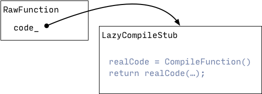

When the function is compiled for the first time this is done by *unoptimizing compiler*.

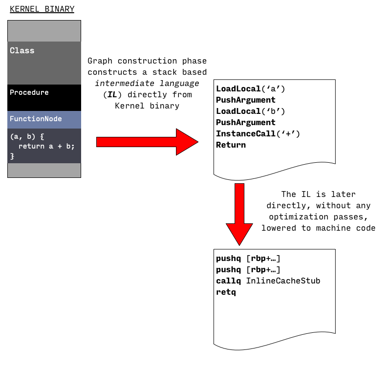

Unoptimizing compiler produces machine code in two passes:

1. Serialized AST for the function's body is walked to generate a *control flow graph* (**CFG**) for the function body. CFG consists of basic blocks filled with *intermediate language* (**IL**) instructions. IL instructions used at this stage resemble instructions of a stack based virtual machine: they take operands from the stack, perform operations and then push results to the same stack.

<aside>In reality not all functions have actual Dart / Kernel AST bodies, e.g. *natives* defined in C++ or artificial tear-off functions generated by Dart VM - in these cases IL is just created from the thin air, instead of being generated from Kernel AST.</aside>

2. resulting CFG is directly compiled to machine code using one-to-many lowering of IL instructions: each IL instruction expands to multiple machine language instructions.

There are no optimizations performed at this stage. The main goal of unoptimizing compiler is to produce executable code quickly.

This also means that unoptimizing compiler does not attempt to statically resolve any calls that were not resolved in Kernel binary, so calls (`MethodInvocation` or `PropertyGet` AST nodes) are compiled as if they were completely dynamic. VM currently does not use any form of *virtual table* or *interface table* based dispatch and instead implements dynamic calls using [*inline caching*](https://en.wikipedia.org/wiki/Inline_caching).

The core idea behind inline caching is to cache results of method resolution in a call site specific cache. Inline caching mechanism used by the VM consists of:

<aside>Original implementations of inline caching were actually patching the native code of the function - hence the name  _**inline** caching_. The idea of inline caching dates far back to Smalltalk-80, see [Efficient implementation of the Smalltalk-80 system](https://dl.acm.org/citation.cfm?id=800542).</aside>

* a call site specific cache (@{dart::RawICData} object) that maps receiver's class to a method, that should be invoked if receiver is of a matching class. The cache also stores some auxiliary information, e.g. invocation frequency counters, which track how often the given class was seen at this call site;
* a shared lookup stub, which implements method invocation fast path. This stub searches through the given cache to see if it contains an entry that matches receiver's class. If the entry is found then stub would increment the frequency counter and tail call cached method. Otherwise stub would invoke a runtime system helper which implements method resolution logic. If method resolution succeeds then cache would be updated and subsequent invocations would not need to enter runtime system.

The picture below illustrates the structure and the state of an inline cache associated with `animal.toFace()` call site, which was executed twice with an instance of `Dog` and once with an instance of a `Cat`.

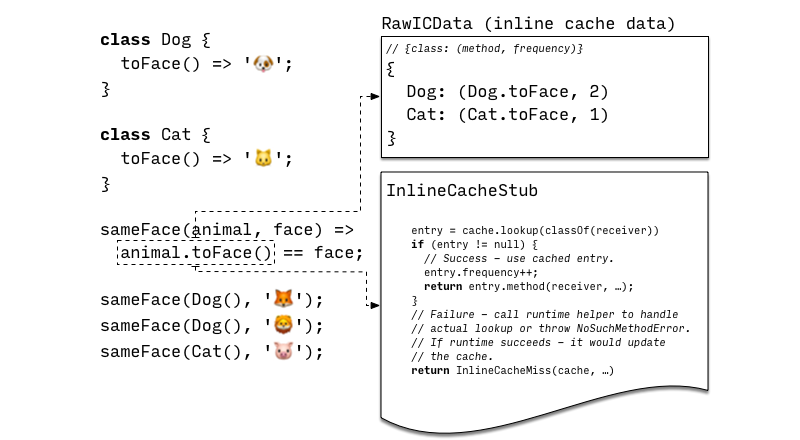

Unoptimizing compiler by itself is enough to execute any possible Dart code. However the code it produces is rather slow, which is why VM also implements *adaptive optimizing* compilation pipeline. The idea behind adaptive optimization is to use execution profile of a running program to drive optimization decisions.

As unoptimized code is running it collects the following information:

* As described above, inline caches collect information about receiver types observed at
callsites;
* Execution counters associated with functions and basic blocks within functions track hot regions of the code.

When an execution counter associated with a function reaches certain threshold, this function is submitted to a *background optimizing compiler* for optimization.

Optimizing compilations starts in the same way as unoptimizing compilation does: by walking serialized Kernel AST to build unoptimized IL for the function that is being optimized. However instead of directly lowering that IL into machine code, optimizing compiler proceeds to translate unoptimized IL into *static single assignment* (SSA) form based optimized IL. SSA based IL is then subjected to speculative specialization based on the collected type feedback and passed through a sequence of classical and Dart specific optimizations: e.g. inlining, range analysis, type propagation, representation selection, store-to-load and load-to-load forwarding, global value numbering, allocation sinking, etc. At the end optimized IL is lowered into machine code using linear scan register allocator and a simple one-to-many lowering of IL instructions.

Once compilation is complete background compiler requests mutator thread to enter a *safepoint* and attaches optimized code to the function.

<aside>Broadly speaking a thread in a managed environment (virtual machine) is considered to be at a *safepoint* when the state associated with it (e.g. stack frames, heap, etc) is consistent and can be accessed or modified without interruption from the thread itself. Usually this implies that the thread is either paused or is executing some code outside of the managed environment e.g. running unmanaged native code. See [GC](/gc.html) page for more information.</aside>

The next time this function is called - it will use optimized code. Some functions contain very long running loops and for those it makes sense to switch execution from unoptimized to optimized code while the function is still running. This process is called *on stack replacement* (**OSR**) owing its name to the fact that a stack frame for one version of the function is transparently replaced with a stack frame for another version of the same function.

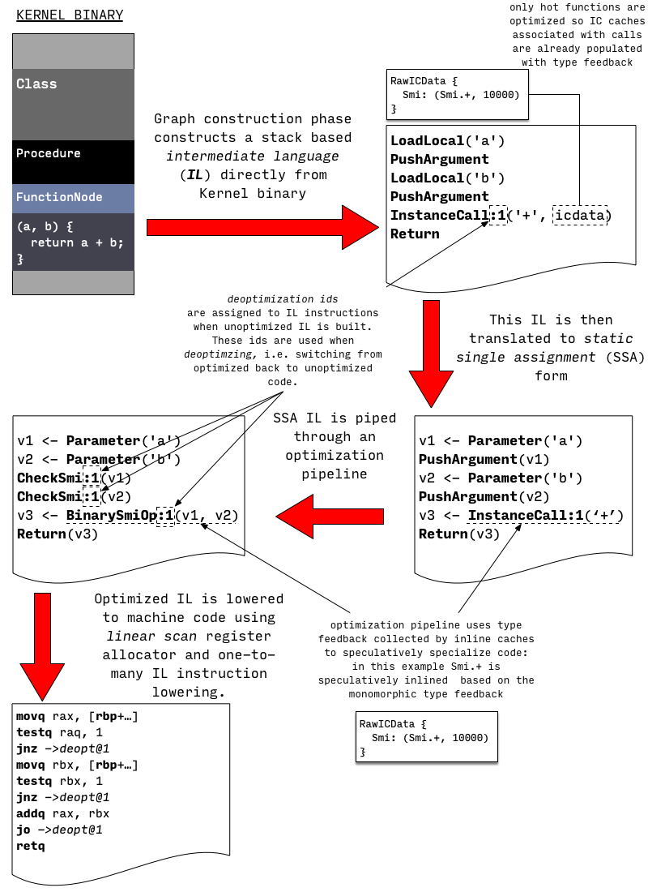

!!! sourcecode "Source to read"
    Compiler sources are in the @{runtime/vm/compiler} directory.
    Compilation pipeline entry point is @{dart::CompileParsedFunctionHelper::Compile}. IL is defined in @{runtime/vm/compiler/backend/il.h}. Kernel-to-IL translation starts in @{dart::kernel::StreamingFlowGraphBuilder::BuildGraph}, and this function also handles construction of IL for various artificial functions. @{dart::compiler::StubCodeCompiler::GenerateNArgsCheckInlineCacheStub} generates machine code for inline-cache stub, while @{InlineCacheMissHandler} handles IC misses. @{runtime/vm/compiler/compiler_pass.cc} defines optimizing compiler passes and their order. @{dart::JitCallSpecializer} does most of the type-feedback based specializations.

!!! tryit "Trying it"
    VM also has flags which can be used to control JIT and to make it dump IL and generated machine code for the functions that are being compiled by the JIT.

    | Flag | Description |
    | ---- | ---- |
    | `--print-flow-graph[-optimized]` | Print IL for all (or only optimized) compilations |
    | `--disassemble[-optimized]` | Disassemble all (or only optimized) compiled functions |
    | `--print-flow-graph-filter=xyz,abc,...` | Restrict output triggered by previous flags only to the functions which contain one of the comma separated substrings in their names |
    | `--compiler-passes=...` | Fine control over compiler passes: force IL to be printed before/after a certain pass. Disable passes by name. Pass `help` for more information |
    | `--no-background-compilation` | Disable background compilation, and compile all hot functions on the main thread. Useful for experimentation, otherwise short running programs might finish before background compiler compiles hot function |

    For example

    ```myshell
    # Run test.dart and dump optimized IL and machine code for
    # function(s) that contain(s) "myFunction" in its name.
    # Disable background compilation for determinism.
    $ dart --print-flow-graph-optimized         \
           --disassemble-optimized              \
           --print-flow-graph-filter=myFunction \
           --no-background-compilation          \
           test.dart
    ```

It is important to highlight that the code generated by optimizing compiler is specialized under speculative assumptions based on the execution profile of the application. For example, a dynamic call site that only observed instances of a single class `C` as a receiver will be converted into a direct call preceeded by a check verifying that receiver has an expected class `C`. However these assumptions might be violated later during execution of the program:

```dart
void printAnimal(obj) {
  print('Animal {');
  print('  ${obj.toString()}');
  print('}');
}

// Call printAnimal(...) a lot of times with an intance of Cat.
// As a result printAnimal(...) will be optimized under the
// assumption that obj is always a Cat.
for (var i = 0; i < 50000; i++)
  printAnimal(Cat());

// Now call printAnimal(...) with a Dog - optimized version
// can not handle such an object, because it was
// compiled under assumption that obj is always a Cat.
// This leads to deoptimization.
printAnimal(Dog());
```

Whenever optimized code is making some optimistic assumptions, which might be
violated during the execution, it needs to guard against such violations and
be able to recover if they occur.

This process of recovery is known as _deoptimization_: whenever optimized version hits a case which it can't handle, it simply transfers execution into the matching point of unoptimized function and continues execution there. Unoptimized version of a function does not make any assumptions and can handle all possible inputs.

<aside>Entering unoptimized function at the right spot is absolutely crucial because code has side-effects (e.g. in the function above deoptimization happens after we already executed the first `print`). Matching instructions that deoptimize to positions in the unoptimized code in VM is done using *deopt ids*</aside>

VM usually discards optimized version of the function after deoptimization and
then reoptimizes it again later - using updated type feedback.

There are two ways VM guards speculative assumptions made by the compiler:

* Inline checks (e.g. `CheckSmi`, `CheckClass` IL instructions) that verify if assumption holds at *use* site where compiler made this assumption. For example, when turning dynamic calls into direct calls compiler adds these checks right before a direct call. Deoptimization that happens on such checks is called *eager deoptimization*, because it occurs eagerly as the check is reached.
* Global guards which instruct runtime to discard optimized code when it changes something that optimized code relies on. For example, optimizing compiler might observe that some class `C` is never extended and use this information during type propagation pass. However subsequent dynamic code loading or class finalization can introduce a subclass of `C` - which invalidates the assumption. At this point runtime needs to find and discard all optimized code that was compiled under the assumption that `C` has no subclasses. It is possible that runtime would find some of the now invalid optimized code on the execution stack - in which case affected frames would be marked for deoptimization and will deoptimize when execution returns to them.  This sort of deoptimization is called *lazy deoptimization*: because it is delayed until control returns back to the optimized code.

!!! sourcecode "Source to read"
    Deoptimizer machinery resides in @{runtime/vm/deopt_instructions.cc}. It is essentially a mini-interpreter for *deoptimization instructions* which describe how to reconstruct needed state of the unoptimized code from the state of optimized code. Deoptimization instructions are generated by @{dart::CompilerDeoptInfo::CreateDeoptInfo} for every potential deoptimization location in optimized code during compilation.

!!! tryit "Trying it"
    Flag `--trace-deoptimization` makes VM print information about the cause and location of every deoptimization that occurs. `--trace-deoptimization-verbose` makes VM print a line for every deoptimization instruction it executes during deoptimization.

### Running from Snapshots

VM has the ability to serialize isolate's heap or more precisely object graph residing in the heap into a binary *snapshot*. Snapshot then can be used to recreate the same state when starting VM isolates.

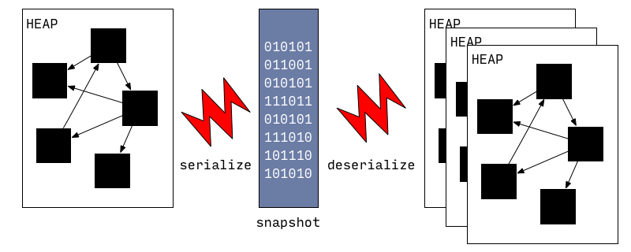

Snapshot's format is low level and optimized for fast startup - it is essentially a list of objects to create and instructions on how to connect them together. That was the original idea behind snapshots: instead of parsing Dart source and gradually creating internal VM data structures, VM can just spin an isolate up with all necessary data structures quickly unpacked from the snapshot.

<aside>The idea of a snapshots has roots in Smalltalk [images](https://en.wikipedia.org/wiki/Smalltalk#Image-based_persistence) which were in turn inspired by [Alan Kay's M.Sc thesis](https://www.mprove.de/visionreality/media/kay68.html). Dart VM is using clustered serialization format which is similar to techniques described in [Parcels: a Fast and Feature-Rich Binary Deployment Technology](http://scg.unibe.ch/archive/papers/Mira05aParcels.pdf) and [Clustered serialization with Fuel](https://rmod.inria.fr/archives/workshops/Dia11a-IWST11-Fuel.pdf) papers.</aside>

Initially snapshots did not include machine code, however this capability was later added when AOT compiler was developed. Motivation for developing AOT compiler and snapshots-with-code was to allow VM to be used on the platforms where JITing is impossible due to platform level restrictions.

Snapshots-with-code work almost in the same way as normal snapshots with a minor difference: they include a code section which unlike the rest of the snapshot does not require deserialization. This code section laid in way that allows it to directly become part of the heap after it was mapped into memory.

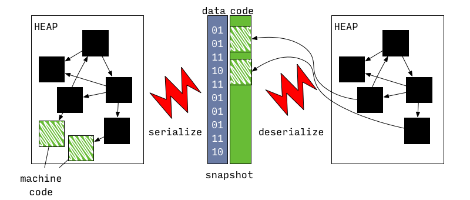

!!! sourcecode "Source to read"
    @{runtime/vm/clustered_snapshot.cc} handles serialization and deserialization of snapshots. A family of API functions `Dart_CreateXyzSnapshot[AsAssembly]` are responsible for writing out snapshots of the heap (e.g. @{Dart_CreateAppJITSnapshotAsBlobs} and @{Dart_CreateAppAOTSnapshotAsAssembly}). On the other hand @{Dart_CreateIsolateGroup} optionally takes snapshot data to start an isolate from.

### Running from AppJIT snapshots

AppJIT snapshots were introduced to reduce JIT warm up time for large Dart applications like `dartanalyzer` or `dart2js`. When these tools are used on small projects they spent as much time doing actual work as VM spends JIT compiling these apps.

AppJIT snapshots allow to address this problem: an application can be run on the VM using some mock training data and then all generated code and VM internal data structures are serialized into an AppJIT snapshot. This snapshot can then be distributed instead of distributing application in the source (or Kernel binary) form. VM starting from this snapshot can still JIT - if it turns out that execution profile on the real data does not match execution profile observed during training.


!!! tryit "Trying it"
    `dart` binary will generate AppJIT snapshot after running the application if you pass `--snapshot-kind=app-jit --snapshot=path-to-snapshot` to it. Here is an example of generating and using an AppJIT snapshot for `dart2js`.

    ```custom-shell-session
    # Run from source in JIT mode.
    $ dart pkg/compiler/lib/src/dart2js.dart -o hello.js hello.dart
    Compiled 7,359,592 characters Dart to 10,620 characters JavaScript in 2.07 seconds
    Dart file (hello.dart) compiled to JavaScript: hello.js

    # Training run to generate app-jit snapshot
    $ dart --snapshot-kind=app-jit --snapshot=dart2js.snapshot \
           pkg/compiler/lib/src/dart2js.dart -o hello.js hello.dart
    Compiled 7,359,592 characters Dart to 10,620 characters JavaScript in 2.05 seconds
    Dart file (hello.dart) compiled to JavaScript: hello.js

    # Run from app-jit snapshot.
    $ dart dart2js.snapshot -o hello.js hello.dart
    Compiled 7,359,592 characters Dart to 10,620 characters JavaScript in 0.73 seconds
    Dart file (hello.dart) compiled to JavaScript: hello.js
    ```

### Running from AppAOT snapshots

AOT snapshots were originally introduced for platforms which make JIT compilation impossible, but they can also be used in situations where fast startup and consistent performance is worth potential peak performance penalty.

<aside>There is usually a lot of confusion around how performance characteristics of JIT and AOT compare. JIT has access to precise local type information and execution profile of the running application, however it has to pay for it with warmup. AOT can infer and prove various properties globally (for which it has to pay with compile time), but has no information of how the program will actually be executing - on the other hand AOT compiled code reaches its peak performance almost immediately with virtual no warmup. Currently Dart VM JIT has best peak performance, while Dart VM AOT has best startup time.</aside>

Inability to JIT implies that:

1. AOT snapshot *must* contain executable code for each and every function that could be invoked during application execution;
2. the executable code *must not* rely on any speculative assumptions that could be violated during execution;

To satisfy these requirements the process of AOT compilation does global static analysis (*type flow analysis* or *TFA*) to determine which parts of the application are reachable from known set of *entry points*, instances of which classes are allocated and how types flow through the program. All of these analyses are conservative: meaning that they err on the side of correctness - which is in stark contrast with JIT which can err on the side of performance, because it can always deoptimize into unoptimized code to implement correct behavior.

All potentially reachable functions are then compiled to native code without any speculative optimizations. However type flow information is still used to specialize the code (e.g. devirtualize calls).

Once all functions are compiled a snapshot of the heap can be taken.

Resulting snapshot can then be run using *precompiled runtime*, a special variant of the Dart VM which excludes components like JIT and dynamic code loading facilities.

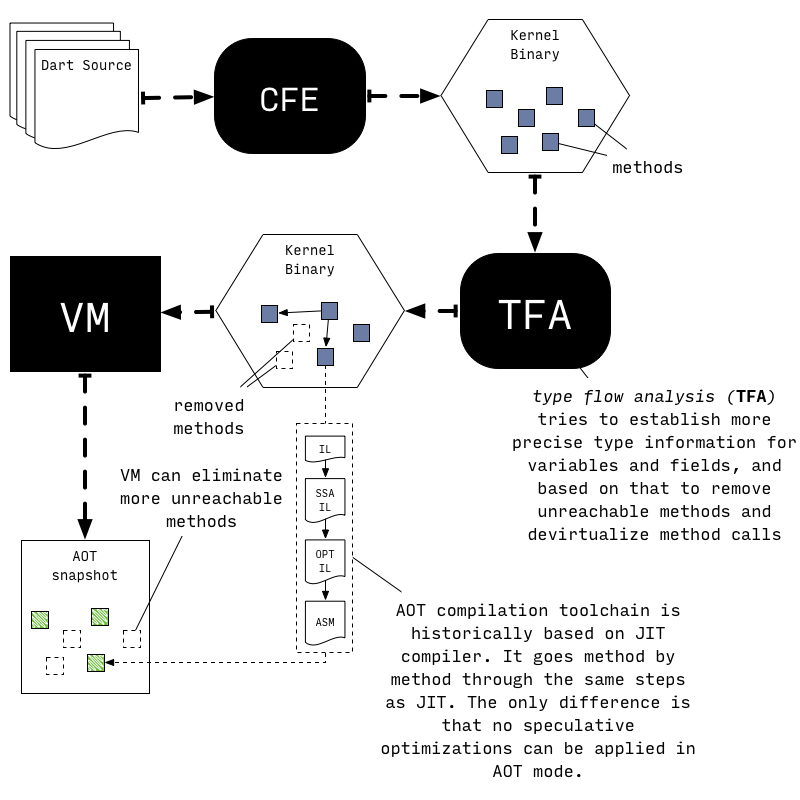

!!! sourcecode "Source to read"
    @{package:vm/transformations/type_flow/transformer.dart} is an entry point to the type flow analysis and transformation based on TFA results. @{dart::Precompiler::DoCompileAll} is an entry point to the AOT compilation loop in the VM.

!!! tryit "Trying it"
    AOT compilation pipeline is currently packaged into Dart SDK as [`dart2native` script](https://dart.dev/tools/dart2native).

    ```custom-shell-session
    $ dart2native hello.dart -o hello
    $ ./hello
    Hello, World!
    ```

    Note that it is impossible to pass options like `--print-flow-graph-optimized` and `--disassemble-optimized` to the `dart2native` script so if you would like to inspect generated AOT code you will need to build compiler from source.

    ```custom-shell-session
    # Need to build normal dart executable and runtime for running AOT code.
    $ tool/build.py -m release -a x64 runtime dart_precompiled_runtime

    # Now compile an application using AOT compiler
    $ pkg/vm/tool/precompiler2 hello.dart hello.aot

    # Execute AOT snapshot using runtime for AOT code
    $ out/ReleaseX64/dart_precompiled_runtime hello.aot
    Hello, World!
    ```

#### Switchable Calls

Even with global and local analyses AOT compiled code might still contain call sites which could not be *devirtualized* (meaning they could not be statically resolved). To compensate for this AOT compiled code and runtime use an extension of inline caching technique utilized in JIT. This extended version is called *switchable calls*.

JIT section already described that each inline cache associated with a call site consists of two pieces: a cache object (represented by an instance of @{dart::RawICData}) and a chunk of native code to invoke (e.g. a @{dart::compiler::StubCodeCompiler::GenerateNArgsCheckInlineCacheStub|InlineCacheStub}). In JIT mode runtime would only update the cache itself. However in AOT runtime can choose to replace both the cache and the native code to invoke depending on the state of the inline cache.

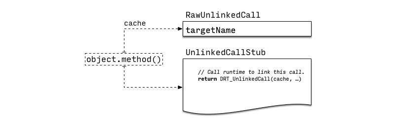

Initially all dynamic calls start in the *unlinked* state. When such call-site is reached for the first time @{dart::compiler::StubCodeCompiler::GenerateUnlinkedCallStub|UnlinkedCallStub} is invoked, which simply calls into runtime helper @{DRT_UnlinkedCall} to link this call site.

If possible @{DRT_UnlinkedCall} tries to transition the call site into a _monomorphic_ state. In this state call site turns into a direct call, which enters method through a special entry point which verifies that receiver has expected class.

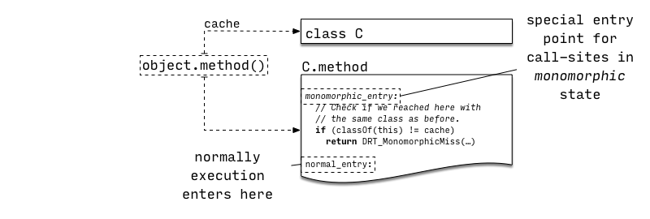

In the example above we assume that when `obj.method()` was executed for the first time `obj` was an instance of `C` and `obj.method` resolved to `C.method`.

Next time we execute the same call-site it would invoke `C.method` directly, bypassing any sort of method lookup process. However it would enter `C.method` through a special entry point, which would verify that `obj` is still an instance of `C`. If that is not the case @{DRT_MonomorphicMiss} would be invoked and will try to select the next call site state.

`C.method` might still be a valid target for an invocation, e.g `obj` is an instance of the class `D` which extends `C` but does not override `C.method`. In this case we check if call site could transition into a *single target* state, implemented by @{dart::compiler::StubCodeCompiler::GenerateSingleTargetCallStub|SingleTargetCallStub} (see also @{dart::RawSingleTargetCache}).

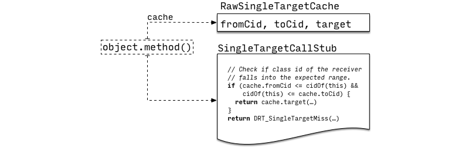

This stub is based on the fact that for AOT compilation most classes are assigned integer ids using depth-first traversal of the inheritance hierarchy. If `C` is a base class with subclasses `D0, ..., Dn` and none of those override `C.method` then `C.:cid <= classId(obj) <= max(D0.:cid, ..., Dn.:cid)` implies that `obj.method` resolves to `C.method`. In this circumstances instead of comparing to a single class (*monomorphic* state), we can use class id range check (*single target* state) which would work for all subclasses of `C`.

Otherwise call site would be switched to use linear search inline cache, similar to the one used in JIT mode (see @{dart::compiler::StubCodeCompiler::GenerateICCallThroughCodeStub|ICCallThroughCodeStub}, @{dart::RawICData} and @{DRT_MegamorphicCacheMissHandler}).


Finally if the number of checks in the linear array grows past threshold the call site is switched to use a dictionary like structure (see @{dart::compiler::StubCodeCompiler::GenerateMegamorphicCallStub|MegamorphicCallStub}, @{dart::RawMegamorphicCache} and @{DRT_MegamorphicCacheMissHandler}).

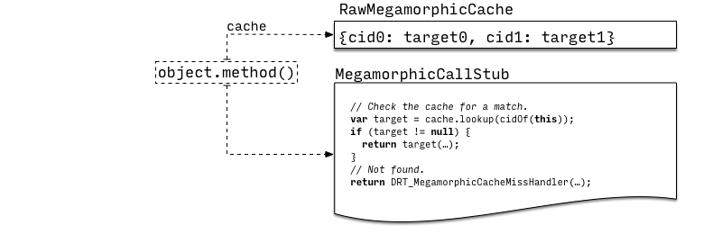

[what-is-kernel]: https://github.com/dart-lang/sdk/blob/master/pkg/kernel/README.md
[pkg-front_end]: https://github.com/dart-lang/sdk/tree/master/pkg/front_end

## Runtime System


!!! WARNING
    This section will be written next.

### Object Model

## TODO

1. Document the difference between CoreJIT and AppJIT snapshots.
2. Document that switchable calls are used in the unoptimized code as well.