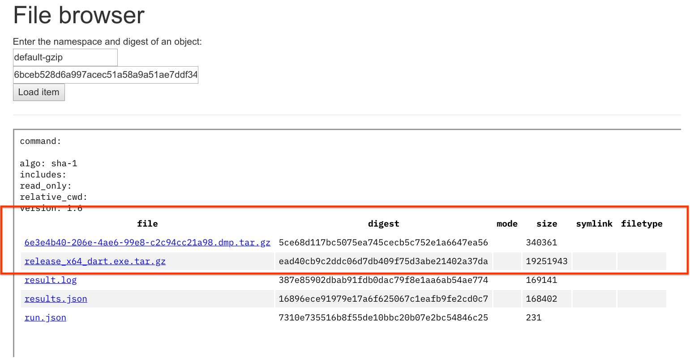

# Crash Dumps Archiving

Testing framework and buildbot/LUCI infrastructure have support for archiving
crash dumps and crashed binaries for unexpected crashes for postmortem
debugging.

This feature is enabled by passing `--copy-coredumps` to `tools/test.py` and
is supported on all three major OSes we run our tests on.

Currently crash dump archiving should be enabled on the majority of the VM
bots, including those running in CQ.

### Known limitations

* We don't archive crash dumps produced by subprocesses (e.g. service tests);
* We don't produce and archive crash dumps for hanged processes.

### Maintainers

For any questions about this infrastructure contact vegorov@, kustermann@ or
athom@.

## Downloading dumps

To find if a bot managed to upload any crashdumps open its log and search for
`Archiving coredumps for crash`. Depending on the bot configuration you
might need to look for uploaded artifacts in two different locations.

### Isolate Server

Swarming bots upload dumps to the isolate server. In this case you will see
something like this in the log:

```
INFO: Core dump archiving is activated
Archiving coredumps for crash (if possible):
----> Crash(language_2/call_method_implicit_tear_off_test/02: binary.release_x64_dart.exe 1556)
+++ Copying 6e3e4b40-206e-4ae6-99e8-c2c94cc21a98.dmp.tar.gz to output_directory (C:\b\s\w\ioz_p_ei)
+++ Copying release_x64_dart.exe.tar.gz to output_directory (C:\b\s\w\ioz_p_ei)
```

If you see `+++ Copying ... to output_directory` this means that the bot
is using isolate storage. In this case you need to look for
`shard #... isolated out` link under the failed step.


This link would bring you to isolate server file browser where you will be
able to download archived artifacts.



### Cloud Storage

Other bots upload collected artifacts into a `dart-temp-crash-archive` Cloud Storage bucket. In this case you will see
`+++ Uploaded gs://dart-temp-crash-archive/...` in the output log. For example:

```
Archiving coredumps for crash (if possible):
----> Crash(language_2/mixin_interface_check_test/mixin: binary.release_ia32_dart.exe 10620)

--- Uploading into gs://dart-temp-crash-archive/0da77e10-d349-4c45-a146-0ce052972b03/ (https://storage.cloud.google.com/dart-temp-crash-archive/0da77e10-d349-4c45-a146-0ce052972b03/) ---
Running command:  ['C:\\b\\s\\w\\ir\\cache\\vpython\\2d366b\\Scripts\\python.exe', 'C:\\b\\s\\w\\ir\\cache\\builder\\sdk\\third_party\\gsutil\\gsutil', 'cp', 'release_ia32_dart.exe.tar.gz', 'gs://dart-temp-crash-archive/0da77e10-d349-4c45-a146-0ce052972b03/release_ia32_dart.exe.tar.gz']
+++ Uploaded gs://dart-temp-crash-archive/0da77e10-d349-4c45-a146-0ce052972b03/release_ia32_dart.exe.tar.gz (https://storage.cloud.google.com/dart-temp-crash-archive/0da77e10-d349-4c45-a146-0ce052972b03/release_ia32_dart.exe.tar.gz)
Running command:  ['C:\\b\\s\\w\\ir\\cache\\vpython\\2d366b\\Scripts\\python.exe', 'C:\\b\\s\\w\\ir\\cache\\builder\\sdk\\third_party\\gsutil\\gsutil', 'cp', 'a92618b1-0f99-4c87-a9fb-adb3e44ad458.dmp.tar.gz', 'gs://dart-temp-crash-archive/0da77e10-d349-4c45-a146-0ce052972b03/a92618b1-0f99-4c87-a9fb-adb3e44ad458.dmp.tar.gz']
+++ Uploaded gs://dart-temp-crash-archive/0da77e10-d349-4c45-a146-0ce052972b03/a92618b1-0f99-4c87-a9fb-adb3e44ad458.dmp.tar.gz (https://storage.cloud.google.com/dart-temp-crash-archive/0da77e10-d349-4c45-a146-0ce052972b03/a92618b1-0f99-4c87-a9fb-adb3e44ad458.dmp.tar.gz)
--- Done ---
```

In this case you can use `gsutil.py` from `depot_tools` (or `gsutil` from Cloud
SDK) to download these artifacts:

```console
$ gsutil.py cp gs://dart-temp-crash-archive/<src-path> <dst-path>
```

## Analyzing Dumps

### Linux

```console
$ gdb <binary> <core>
```

Because bots are running slightly different Linux versions that what is
available on development machines `gdb` might not be able to properly
resolve symbols and unwind the stack by itself.

In this case you can:

* spin up a Cloud Instance with a matching OS version and debug the dump
on that instance;
* create a sysroot that matches operating system on the bots and tell gdb to
use that sysroot with `set sysroot` command.

#### ARM/ARM64

If you have a core produced on ARM or ARM64 bot and you would like to inspect
it on a non-ARM development machine, then you will need `gdb-multiarch` and
sysroot that matches OS version on the bot. Then you can use `set sysroot ...`
and `set architecture ...` to configure `gdb-multiarch` before loading `core`.

### Mac

```console
$ lldb <binary> -c <core>
```

### Windows

Googlers can find WinDBG and CDB in `%depot_tools%\win_toolchain\vs_files\%toolchain_version%\win_sdk\Debuggers\x64\`.

For quick investigation you can do

```console
> cdb.exe -z <coredump.dmp>
...
0:000> !uniqstack
...
```

## Implementation details

Implementation of crash dump archiving consists of two parts:

* Code in the testing framework (`UnexpectedCrashLogger` in
`pkg/test_runner/lib/src/test_progress.dart`) that detects unexpected crashes,
that is situations when test _unexpectedly_ completes with a `Crash` status. In
this case it logs a line about this crash into `unexpected-crashes` file in the
root of the SDK checkout. This line has format `test,pid,binary` and identifies
which test crashed, what was the process id and which binary crashed.
* Code in the Python wrapper around testing framework (see `CoreDumpArchiver`
in `tools/utils.py`) is responsible for
    * Before tests: configuring OS and/or environment to setup crashdump
      archiving in the OS specific way (see classes with names ending at
      `CoreDumpEnabler`);
    * After tests: trying to locate crashdumps written by OS or crash reporting
      library and match those to unexpected crashes reporting by testing
      framework (see classes with names ending at `CoreDumpArchiver`);
    * Selecting a subset of crashdumps and uploading those into a persistent
      storage (isolate server or Cloud Storage bucket).

### Linux

We rely on builtin ability of the OS to generate core files (`man core`) when
the program is terminated abnormally.

We adjust core resource limits to `unlimited` before running tests. See `man setrlimit` for more information (search for `RLIMIT_CORE`).

We verify that `/proc/sys/kernel/core_pattern` is set to `core.%p` which
means that crash dumps would be produced in the current working directory (root of the SDK checkout for most tests) and mangled with the pid of the crashed
process.

Core dump archiving code then uses pids to match unexpected crashes with core
dumps.

See `LinuxCoreDumpArchiver` and `LinuxCoreDumpEnabler` in `tools/utils.py`.

### Mac

Just like on Linux we rely on OS to produce core files (`man core`) and
similarly set core resource limits to `unlimited`.

Core files are also mangled with PID of the crashing process.

The only difference from Linux is that on Mac core files are written into
`/cores` directory instead of current working directory.

See `MacOSCoreDumpArchiver` and `PosixCoreDumpEnabler` in `tools/utils.py`.

### Windows

On Windows we rely on [Crashpad](https://chromium.googlesource.com/crashpad/crashpad/+/master/README.md)
library to produce minidumps of the crashed process, because configuring
builtin crash reporting functionality requires registry changes that are global,
impossible without Administrator privileges and are overwritten by buildbot
fleet management software running in background.

Crashpad integration for `dart.exe` and `run_vm_tests.exe` binaries is
controlled by `dart_use_crashpad` GN argument.

This argument is set to `true` when `tools/gn.py` is run with `--use-crashpad`
flag or with `DART_USE_CRASHPAD` environment variable set.

If the binary is built with Crashpad integration it checks two environment
variables on startup:

* `DART_CRASHPAD_HANDLER` should contain path to `crashpad_handler.exe`
Crashpad binary that implements out-of-process crash monitoring;
* `DART_CRASHPAD_CRASHES_DIR` should contain path to a folder, which would be
used as Crashpad crash database.

If both variables are set then Crashpad handler will be started. If the handler
catches main binary crashing it would write [minidump](https://docs.microsoft.com/en-us/windows/desktop/debug/minidump-files)
into `%DART_CRASHPAD_CRASHES_DIR%\crashes` from where it would be picked up
by crash archiving machinery.

We match crash dumps to unexpected crashes by parsing them and extracting
process id of the crashed process (see `utils/minidump.py` library).

See `WindowsCoreDumpEnabler` and `WindowsCoreDumpArchiver` in `tools/utils.py`.

**Note: `DART_CRASHPAD_CRASHES_DIR` is set by `WindowsCoreDumpEnabler` in
`tools/utils.py`, while `DART_CRASHPAD_HANDLER` is set by `TestSuite` in
`pkg/test_runner/lib/src/test_suite.dart`.**

**Note: Crashpad is optimized for end-user crash reporting use case and does not write full crash dumps.**

