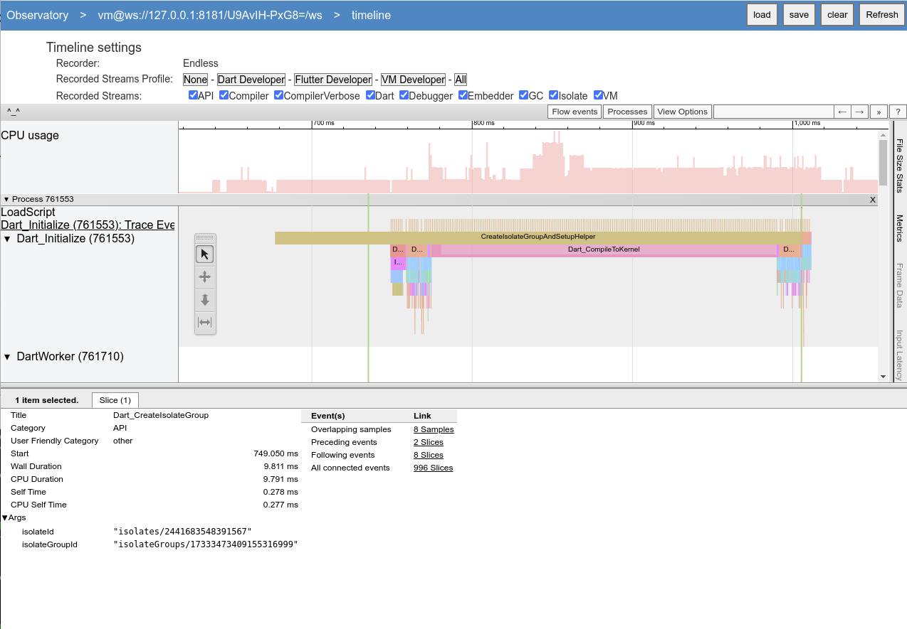
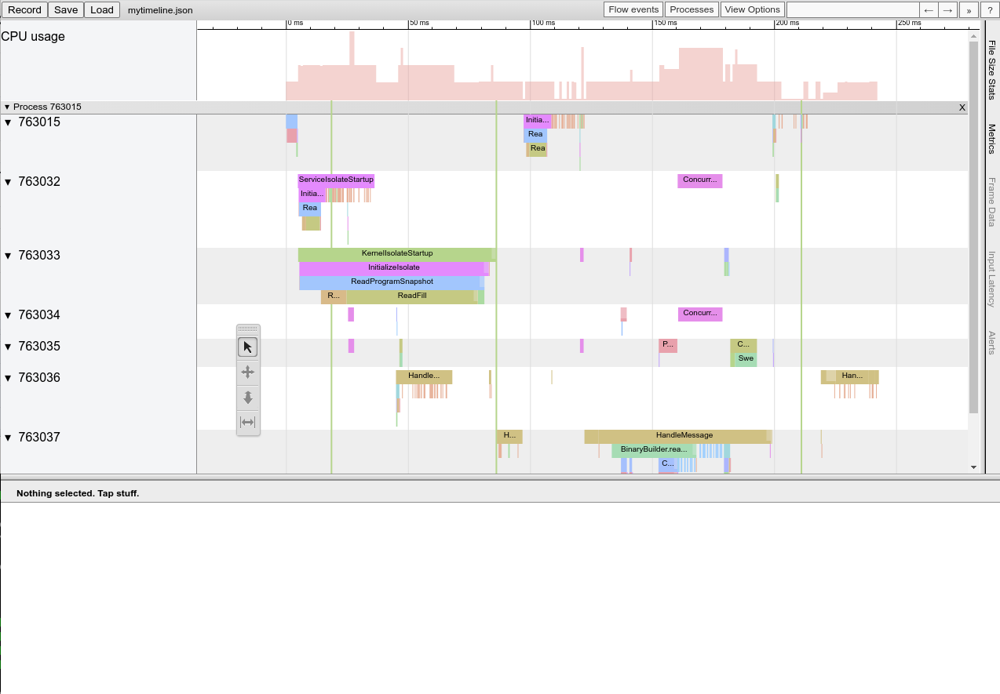

# Timeline

The timeline, also called tracing, provides a way to see when manually annotated events are running and how much time they are taking.

## Recorders

| Name      | Description |
| --------- | ------------|
| `none`    | All events are dropped. |
| `ring`    | Fixed-size buffer. Once full, new events overwrite the oldest events. |
| `startup` | Fixed-size buffer. Once full, new events are dropped. |
| `endless` | Infinite buffer. Eventually the process may die from hitting out of memory. |
| `file`    | Writes events to a file in [Chrome Trace Format](https://docs.google.com/document/d/1CvAClvFfyA5R-PhYUmn5OOQtYMH4h6I0nSsKchNAySU). This format can be visualized with `chrome://tracing`. |
| `systrace` (Linux/Android) | Writes events to [Systrace](https://source.android.com/docs/core/tests/debug/systrace). |
| `systrace` (Fuchsia) | Writes events to [Fuchsia tracing](https://fuchsia.dev/fuchsia-src/development/tracing/). |
| `systrace` (Mac/iOS) | Writes events to [Signposts](https://help.apple.com/instruments). |

The recorder can be selected with the `timeline_recorder` flag. E.g., `--timeline_recorder=startup` or `--timeline_recorder=file=mytrace.json`.

If the recorder uses a VM-internal buffer (`ring`, `startup`, `endless`), then the timeline can be retrieved using the `getVMTimeline` method of the [VM service](../vm/service/service.md).

## Streams

Streams, also called categories, are sets of events whose recordering can be enabled or disabled.

| Name      | Description |
| --------- | ------------|
| `API` | Calls to the `Dart_*` embedding API functions. |
| `Compiler` | Time spent compiling Dart / RegExp to machine code. |
| `CompilerVerbose` | Events for detailed compiler phases. |
| `Dart` | Events created by `dart:developer`'s `Timeline` etc. |
| `Debugger` | |
| `Embedder` | Events created by `Dart_RecordTimelineEvent`. |
| `GC` | Events related to garbage collection or heap iteration. |
| `Isolate` | Isolate or isolate group lifecycle events such as startup or shutdown. |
| `VM` | VM lifecycle events such a startup or shutdown. |

The set of enabled streams can be selected with the `timeline_streams` flag. E.g., `--timeline_stream=VM,Isolate,GC,Dart` or `--timeline_streams=All`.

The set of enabled streams can also be changed at runtime using the `setVMTimelineFlags` method of the [VM service](../vm/service/service.md).

## Usage

There are also some convenience flags:

| Flag | Expansion |
| ---- | --------- |
|`--timeline_streams=All` | `--timeline_streams=API,Compiler,CompilerVerbose,Dart,Debugger,Embedder,GC,Isolate,VM` |
| `--complete_timeline` | `--timeline_recorder=endless --timeline_streams=All` |
| `--startup_timeline` | `--timeline_recorder=startup --timeline_streams=All` |

### Example

```
$ dart --observe --complete-timeline hello.dart
The Dart VM service is listening on http://127.0.0.1:8181/U9AvIH-PxG8=/
# Navigate to the URL, and select "view timeline".
```


### Example

```
$ dart --timeline_recorder=file:mytimeline.json --timeline_streams=VM,Isolate,GC,Dart hello.dart
# Navigate to chrome://tracing and load mytimeline.json.
```

