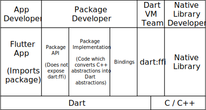
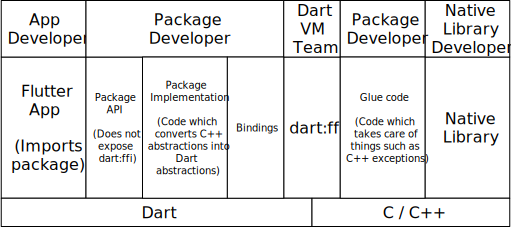

# dart:ffi SQLite mini tutorial

In this mini tutorial we learn how to bind SQLite, a native library, in Dart using Dart's new foreign function interface `dart:ffi`.
We build a package which provides a Dartlike SQLite API using objects and `Iterator`s.
Inside the package we write Dart code which directly invokes C functions and manipulates C memory.

## Binding C Functions to Dart

The first step is to load a Native Library:

```dart
import "dart:ffi";

DynamicLibrary sqlite = dlopenPlatformSpecific("sqlite3");
```

In a `DynamicLibrary` we can `lookup` functions.
Let's lookup the function `sqlite3_prepare_v2` in the SQLite library.
That function has the following signature in the library header file.

```c++
SQLITE_API int sqlite3_prepare_v2(
  sqlite3 *db,            /* Database handle */
  const char *zSql,       /* SQL statement, UTF-8 encoded */
  int nByte,              /* Maximum length of zSql in bytes. */
  sqlite3_stmt **ppStmt,  /* OUT: Statement handle */
  const char **pzTail     /* OUT: Pointer to unused portion of zSql */
);
```

In order to lookup a function, we need a _C signature_ and a _Dart signature_.

```dart
typedef sqlite3_prepare_v2_native_t = Int32 Function(
    DatabasePointer database,
    CString query,
    Int32 nbytes,
    Pointer<StatementPointer> statementOut,
    Pointer<CString> tail);

typedef Sqlite3_prepare_v2_t = int Function(
    DatabasePointer database,
    CString query,
    int nbytes,
    Pointer<StatementPointer> statementOut,
    Pointer<CString> tail);
```

With these two signatures we can `lookup` the C function and expose it as a Dart function with `asFunction`.

```dart
Sqlite3_prepare_v2_t sqlite3_prepare_v2 = sqlite
    .lookup<NativeFunction<sqlite3_prepare_v2_native_t>>("sqlite3_prepare_v2")
    .asFunction();
```

Browse the code: [platform specific dynamic library loading](../lib/src/ffi/dylib_utils.dart), [C signatures](../lib/src/bindings/signatures.dart), [Dart signatures and bindings](../lib/src/bindings/bindings.dart), and [dart:ffi dynamic library interface](../../../../sdk/lib/ffi/dynamic_library.dart).

## Managing C Memory

In order to call `sqlite3_prepare_v2` to prepare a SQLite statement before executing, we need to be able to pass C pointers to C functions.

Database and Statement pointers are opaque pointers in the SQLite C API.
We specify these as classes extending `Pointer<Void>`.

```dart
class DatabasePointer extends Pointer<Void> {}
class StatementPointer extends Pointer<Void> {}
```

Strings in C are pointers to character arrays.

```dart
class CString extends Pointer<Uint8> {}
```

Pointers to C integers, floats, an doubles can be read from and written through to `dart:ffi`.
However, before we can write to C memory from dart, we need to `allocate` some memory.

```dart
Pointer<Uint8> p = allocate(); // Infers type argument allocate<Uint8>(), and allocates 1 byte.
p.value = 123;                 // Stores a Dart int into this C int8.
int v = p.value;               // Loads a value from C memory.
```

Note that you can only load a Dart `int` from a C `Uint8`.
Trying to load a Dart `double` will result in a runtime exception.

We've almost modeled C Strings.
The last thing we need is to use this `Pointer` as an array.
We can do this by using `elementAt`.

```dart
CString string = allocate(count: 4).cast(); // Allocates 4 bytes and casts it to a string.
string.value = 70;                          // Stores 'F' at index 0.
string[1] = 70;                             // Stores 'F' at index 1.
string[2] = 73;                             // Stores 'I' at index 2.
string[3] = 0;                              // Null terminates the string.
```

We wrap the above logic of allocating strings in the constructor `CString.allocate`.

Now we have all ingredients to call `sqlite3_prepare_v2`.

```dart
Pointer<StatementPointer> statementOut = allocate();
CString queryC = CString.allocate(query);
int resultCode = sqlite3_prepare_v2(
    _database, queryC, -1, statementOut, nullptr);
```

With `dart:ffi` we are responsible for freeing C memory that we allocate.
So after calling `sqlite3_prepare_v2` we read out the statement pointer, and free the statement pointer pointer and `CString` which held the query string.

```
StatementPointer statement = statementOut.value;
statementOut.free();
queryC.free();
```

Browse the code: [CString class](../lib/src/ffi/utf8.dart), [code calling sqlite3_prepare_v2](../lib/src/database.dart#57), and [dart:ffi pointer interface](../../../../sdk/lib/ffi/ffi.dart).

## Dart API

We would like to present the users of our package with an object oriented API - not exposing any `dart:ffi` objects to them.

The SQLite C API returns a cursor to the first row of a result after executing a query.
We can read out the columns of this row and move the cursor to the next row.
The most natural way to expose this in Dart is through an `Iterable`.
We provide our package users with the following API.

```dart
class Result implements Iterable<Row> {}

class Row {
  dynamic readColumnByIndex(int columnIndex) {}
  dynamic readColumn(String columnName) {}
}
```

However, this interface does not completely match the semantics of the C API.
When we start reading the next `Row`, we do no longer have access to the previous `Row`.
We can model this by letting a `Row` keep track if its current or not.

```dart
class Row {
  bool _isCurrentRow = true;

  dynamic readColumnByIndex(int columnIndex) {
    if (!_isCurrentRow) {
      throw Exception(
          "This row is not the current row, reading data from the non-current"
          " row is not supported by sqlite.");
    }
    // ...
    }
}
```

A second mismatch between Dart and C is that in C we have to manually release resources.
After executing a query and reading its results we need to call `sqlite3_finalize(statement)`.

We can take two approaches here, either we structure the API in such a way that users of our package (implicitly) release resources, or we use finalizers to release resources.
In this tutorial we take the first approach.

If our users iterate over all `Row`s, we can implicitly finalize the statement after they are done with the last row.
However, if they decide they do not want to iterate over the whole result, they need to explicitly state this.
In this tutorial, we use the `ClosableIterator` abstraction for `Iterators` with backing resources that need to be `close`d.

```dart
Result result = d.query("""
  select id, name
  from Cookies
  ;""");
for (Row r in result) {
  String name = r.readColumn("name");
  print(name);
}
// Implicitly closes the iterator.

result = d.query("""
  select id, name
  from Cookies
  ;""");
for (Row r in result) {
  int id = r.readColumn("id");
  if (id == 1) {
    result.close(); // Explicitly closes the iterator, releasing underlying resources.
    break;
  }
}
```

Browse the code: [Database, Result, Row](../lib/src/database.dart), and [CloseableIterator](../lib/src/collections/closable_iterator.dart).

## Architecture Overview

The following diagram summarized what we have implemented as _package developers_ in this tutorial.



As the package developers wrapping an existing native library, we have only written Dart code - not any C/C++ code.
We specified bindings to the native library.
We have provided our package users with an object oriented API without exposing any `dart:ffi` objects.
And finally, we have implemented the package API by calling the C API.

## Current dart:ffi Development Status

In this minitutorial we used these `dart:ffi` features:

* Loading dynamic libararies and looking up C functions in these dynamic libraries.
* Calling C functions, with `dart:ffi` automatically marshalling arguments and return value.
* Manipulating C memory through `Pointer`s with `allocate`, `free`, `load`, `store`, and `elementAt`.

Features which we did not use in this tutorial:

* `@struct` on subtypes of `Pointer` to define a struct with fields. (However, this feature is likely to change in the future.)

Features which `dart:ffi` does not support yet:

* Callbacks from C back into Dart.
* Finalizers
* C++ Exceptions (Not on roadmap yet.)

Platform limitations:

* `dart:ffi` is only enabled on 64 bit Windows, Linux, and MacOS. (Arm64 and 32 bit Intel are under review.)
* `dart:ffi` only works in JIT mode, not in AOT.

It is possible to work around some of the current limitations by adding a C/C++ layer.
For example we could catch C++ exceptions in a C++ layer, and rethrow them in Dart.
The architecture diagram would change to the following in that case.


